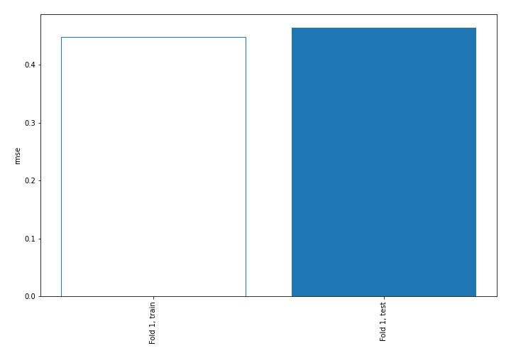
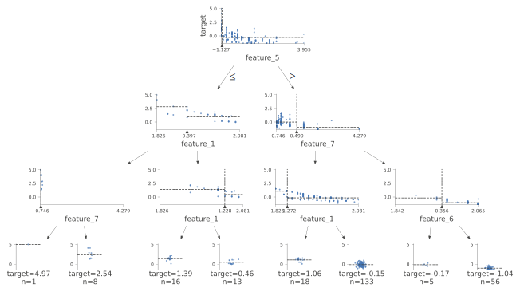
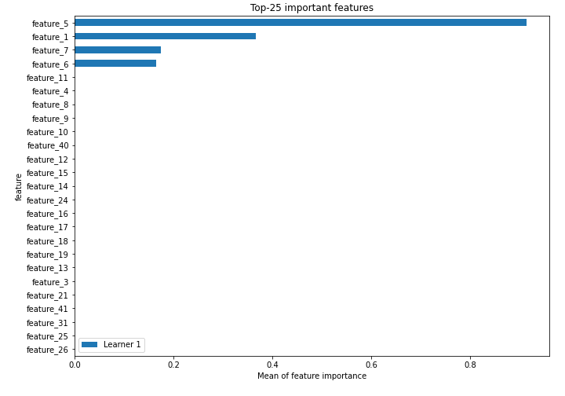
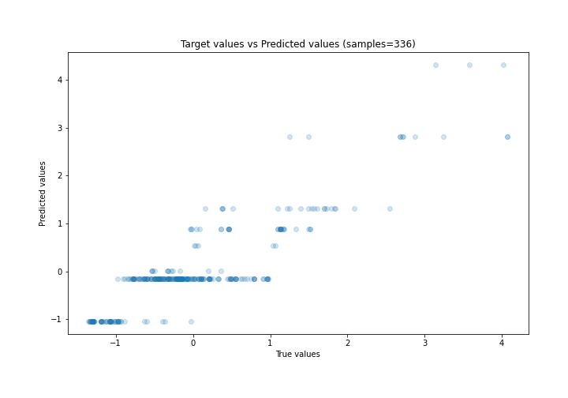
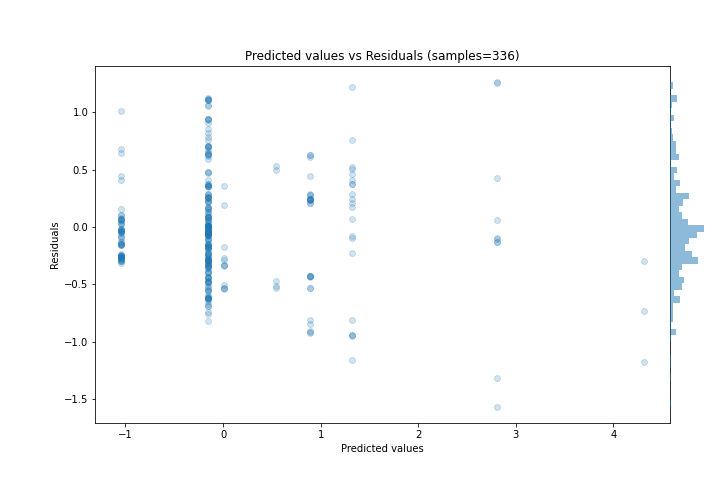
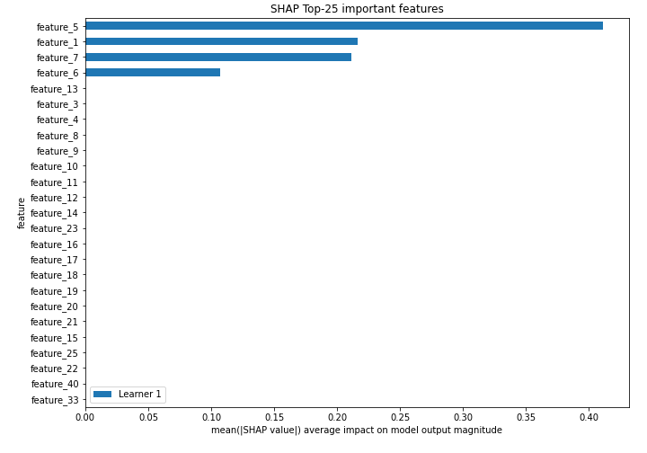
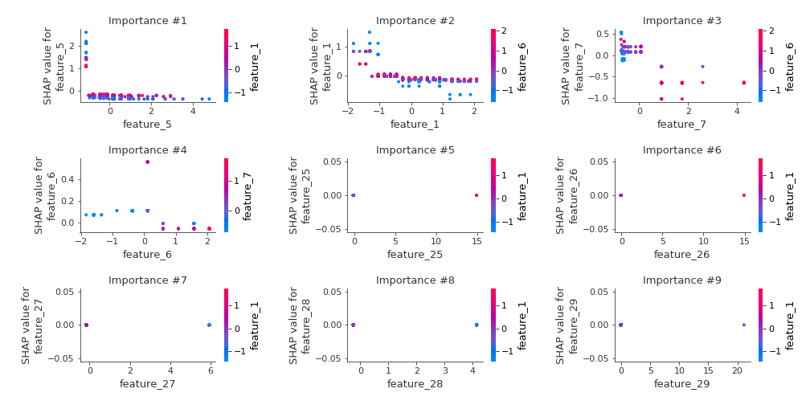
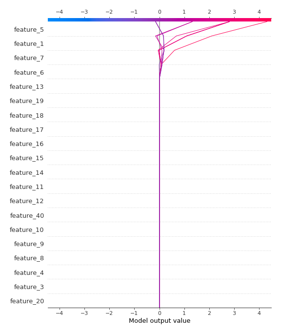
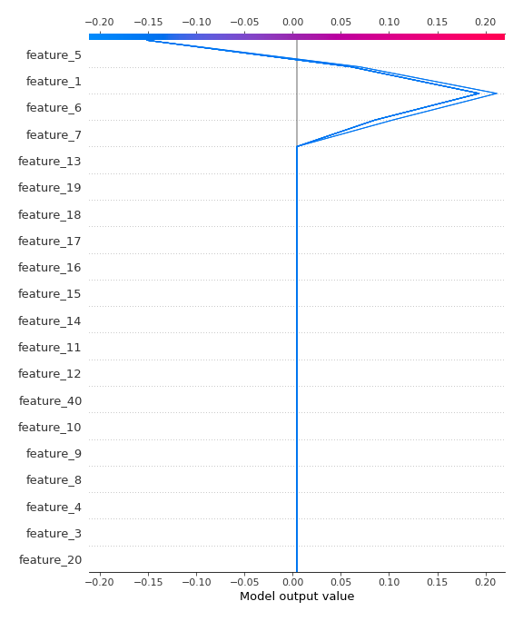

# Summary of 2_DecisionTree

[<< Go back](../README.md)

## Decision Tree
- **n_jobs**: -1
- **criterion**: mse
- **max_depth**: 3
- **explain_level**: 2

## Validation
 - **validation_type**: split
 - **train_ratio**: 0.75
 - **shuffle**: True

## Optimized metric
rmse

## Training time

8.3 seconds

### Metric details:
| Metric   |    Score |
|:---------|---------:|
| MAE      | 0.352842 |
| MSE      | 0.215607 |
| RMSE     | 0.464335 |
| R2       | 0.772306 |
| MAPE     | 1.73709  |

## Learning curves

## Decision Tree 

### Tree #1

### Rules

if (feature_5 > -1.063) and (feature_7 <= 0.49) and (feature_1 > -1.272) then response: -0.151 | based on 571 samples

if (feature_5 > -1.063) and (feature_7 > 0.49) and (feature_6 > 0.356) then response: -1.04 | based on 198 samples

if (feature_5 > -1.063) and (feature_7 <= 0.49) and (feature_1 <= -1.272) then response: 0.891 | based on 87 samples

if (feature_5 <= -1.063) and (feature_1 > -0.397) and (feature_1 <= 1.228) then response: 1.322 | based on 61 samples

if (feature_5 <= -1.063) and (feature_1 > -0.397) and (feature_1 > 1.228) then response: 0.541 | based on 33 samples

if (feature_5 <= -1.063) and (feature_1 <= -0.397) and (feature_7 > -0.707) then response: 2.812 | based on 26 samples

if (feature_5 > -1.063) and (feature_7 > 0.49) and (feature_6 <= 0.356) then response: 0.007 | based on 21 samples

if (feature_5 <= -1.063) and (feature_1 <= -0.397) and (feature_7 <= -0.707) then response: 4.314 | based on 11 samples

## Permutation-based Importance

## True vs Predicted

## Predicted vs Residuals

## SHAP Importance

## SHAP Dependence plots

### Dependence (Fold 1)

## SHAP Decision plots

### Top-10 Worst decisions (Fold 1)

### Top-10 Best decisions (Fold 1)

[<< Go back](../README.md)
