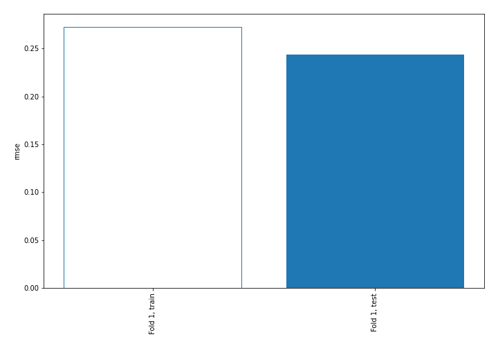
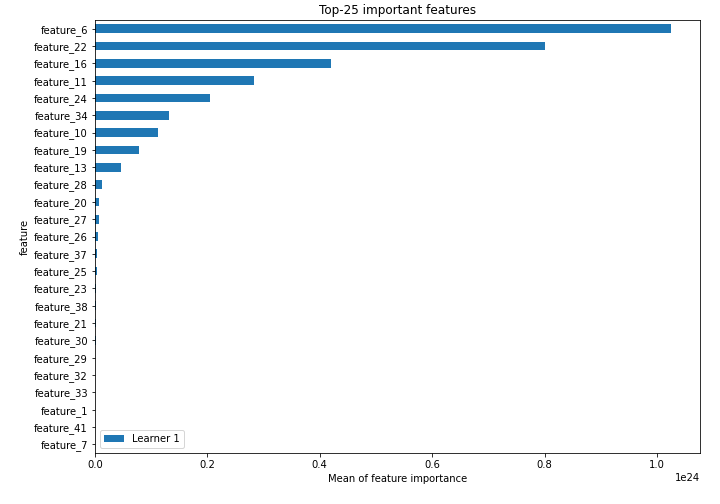
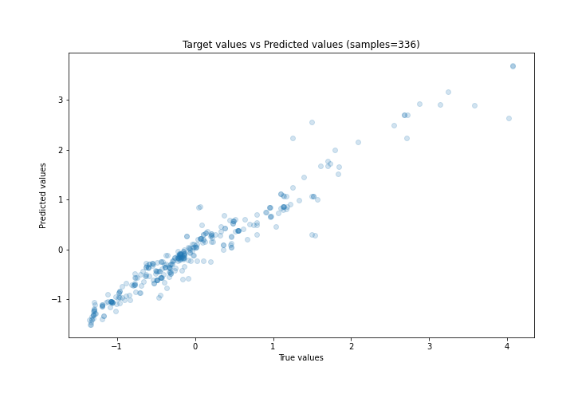
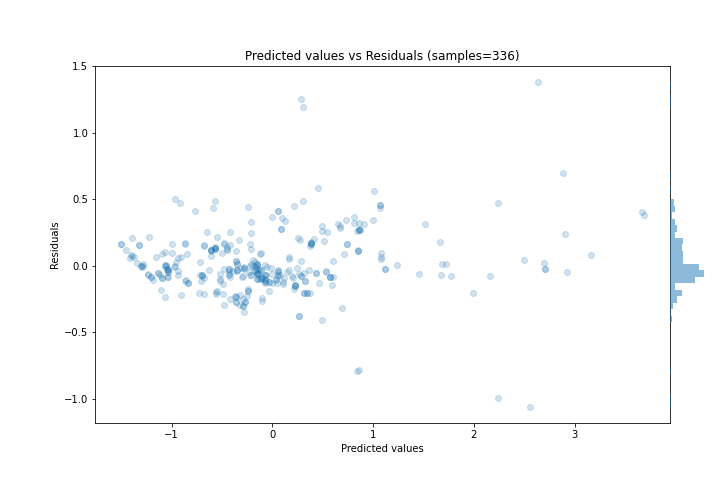
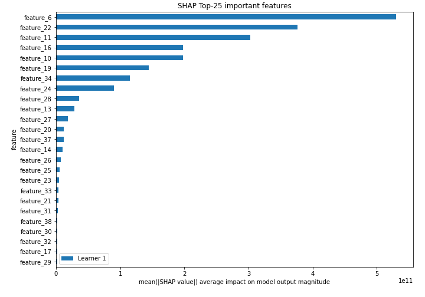
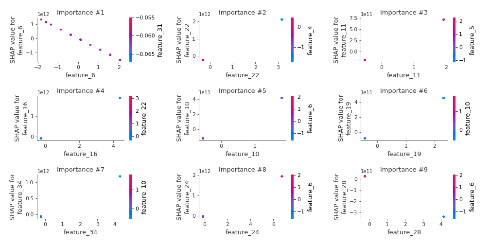
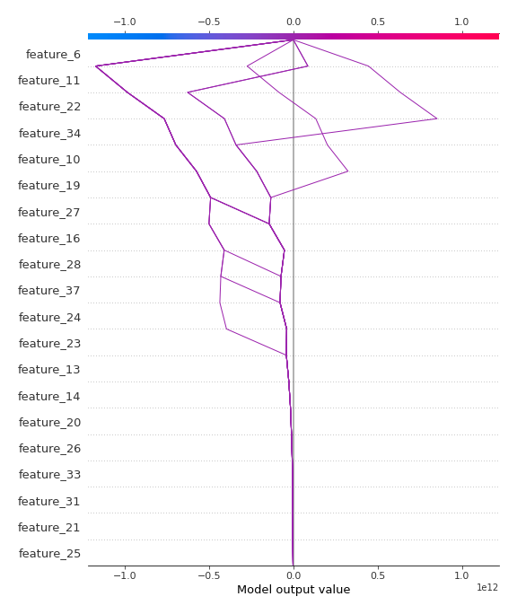
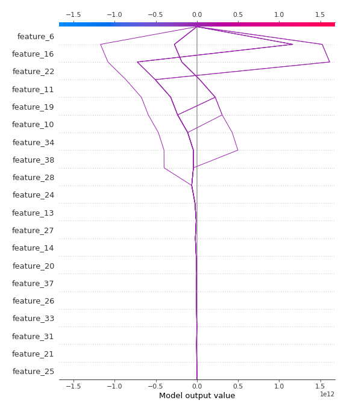

# Summary of 3_Linear

[<< Go back](../README.md)

## Linear Regression (Linear)
- **n_jobs**: -1
- **explain_level**: 2

## Validation
 - **validation_type**: split
 - **train_ratio**: 0.75
 - **shuffle**: True

## Optimized metric
rmse

## Training time

6.7 seconds

### Metric details:
| Metric   |     Score |
|:---------|----------:|
| MAE      | 0.16155   |
| MSE      | 0.0592526 |
| RMSE     | 0.243419  |
| R2       | 0.937426  |
| MAPE     | 0.702164  |

## Learning curves

## Coefficients
| feature    |    Learner_1 |
|:-----------|-------------:|
| feature_22 |  6.71765e+11 |
| feature_16 |  4.27799e+11 |
| feature_11 |  3.67915e+11 |
| feature_24 |  2.8765e+11  |
| feature_34 |  2.78029e+11 |
| feature_10 |  2.28785e+11 |
| feature_19 |  1.96917e+11 |
| feature_13 |  1.52369e+11 |
| feature_14 |  1.20525e+11 |
| feature_26 |  6.00813e+10 |
| feature_20 |  5.68636e+10 |
| feature_17 |  5.39809e+10 |
| feature_35 |  3.92774e+10 |
| feature_25 |  3.60853e+10 |
| feature_21 |  3.29535e+10 |
| feature_12 |  2.45739e+10 |
| feature_15 |  2.45739e+10 |
| feature_33 |  2.14083e+10 |
| feature_38 |  2.0865e+10  |
| feature_39 |  1.47592e+10 |
| feature_40 |  1.11222e+10 |
| feature_7  |  0.140549    |
| feature_4  |  0.0792516   |
| feature_3  |  0.0740644   |
| feature_5  |  0.0484662   |
| intercept  | -0.0050024   |
| feature_41 | -0.194427    |
| feature_1  | -0.447021    |
| feature_18 | -4.83321e+09 |
| feature_8  | -9.72213e+09 |
| feature_36 | -1.36347e+10 |
| feature_32 | -1.36347e+10 |
| feature_29 | -1.68267e+10 |
| feature_30 | -2.07074e+10 |
| feature_23 | -2.74266e+10 |
| feature_31 | -3.27047e+10 |
| feature_9  | -3.42403e+10 |
| feature_37 | -4.52429e+10 |
| feature_27 | -5.83394e+10 |
| feature_28 | -8.13282e+10 |
| feature_6  | -7.35969e+11 |

## Permutation-based Importance

## True vs Predicted

## Predicted vs Residuals

## SHAP Importance

## SHAP Dependence plots

### Dependence (Fold 1)

## SHAP Decision plots

### Top-10 Worst decisions (Fold 1)

### Top-10 Best decisions (Fold 1)

[<< Go back](../README.md)
