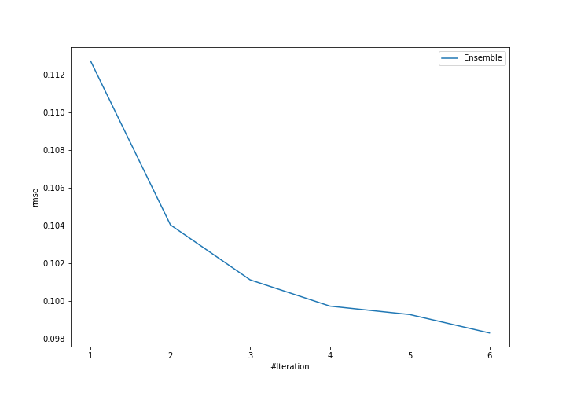
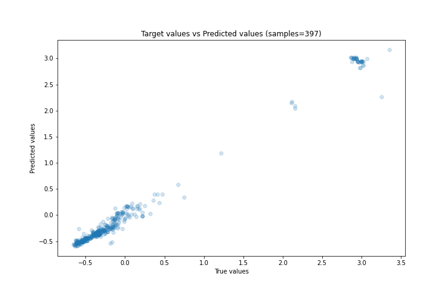
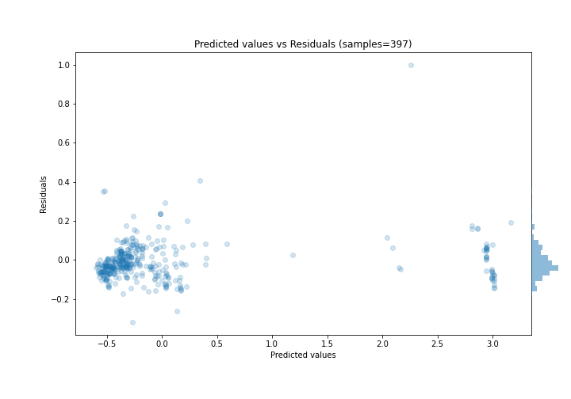

# Summary of Ensemble

[<< Go back](../README.md)

## Ensemble structure
| Model                   |   Weight |
|:------------------------|---------:|
| 2_DecisionTree          |        1 |
| 4_Default_Xgboost       |        2 |
| 5_Default_NeuralNetwork |        3 |

### Metric details:
| Metric   |      Score |
|:---------|-----------:|
| MAE      | 0.0657073  |
| MSE      | 0.00966092 |
| RMSE     | 0.09829    |
| R2       | 0.990784   |
| MAPE     | 0.544804   |

## Learning curves

## True vs Predicted

## Predicted vs Residuals

[<< Go back](../README.md)
