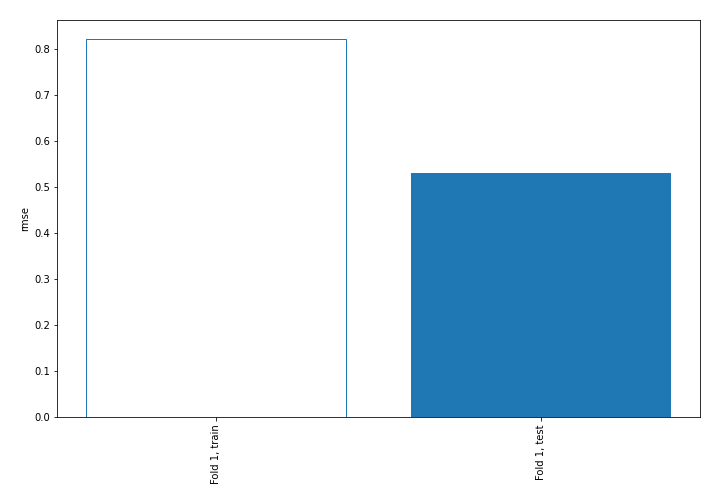
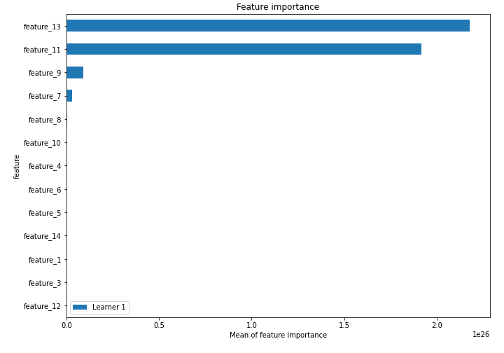
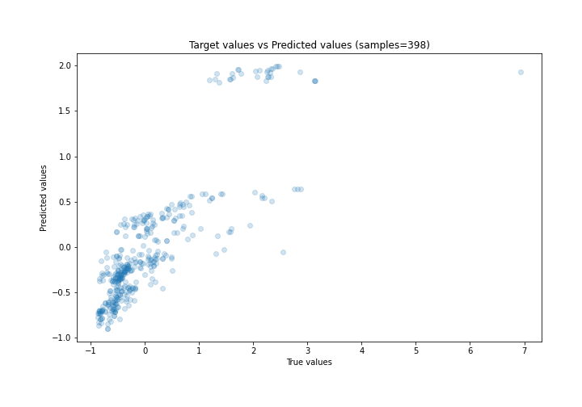
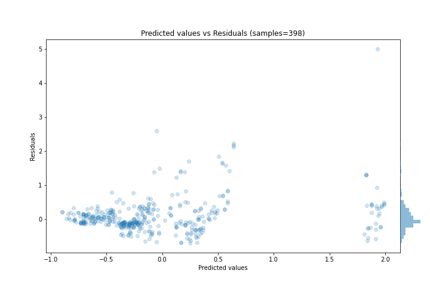
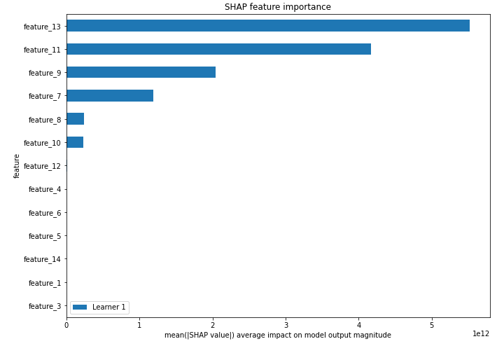
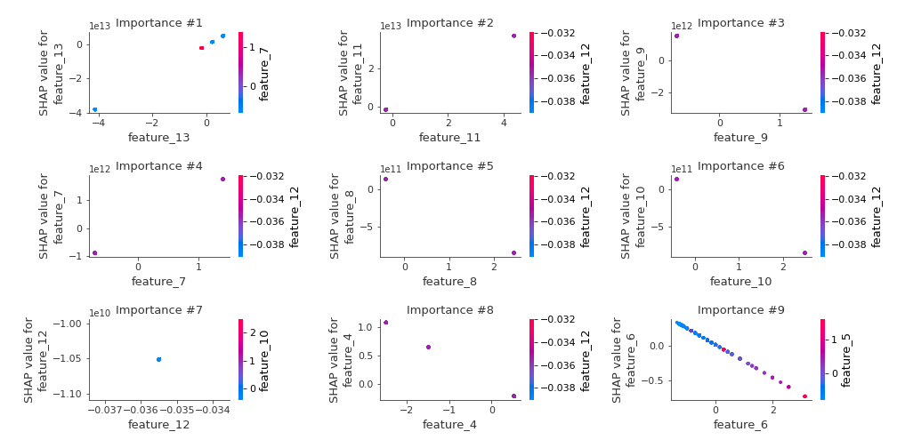
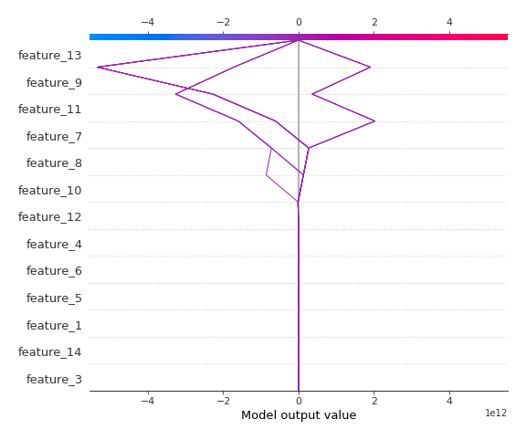

# Summary of 3_Linear

[<< Go back](../README.md)

## Linear Regression (Linear)
- **n_jobs**: -1
- **explain_level**: 2

## Validation
 - **validation_type**: split
 - **train_ratio**: 0.75
 - **shuffle**: True

## Optimized metric
rmse

## Training time

4.2 seconds

### Metric details:
| Metric   |    Score |
|:---------|---------:|
| MAE      | 0.311292 |
| MSE      | 0.280951 |
| RMSE     | 0.530048 |
| R2       | 0.683586 |
| MAPE     | 1.93774  |

## Learning curves

## Coefficients
| feature    |    Learner_1 |
|:-----------|-------------:|
| feature_13 |  9.16665e+12 |
| feature_11 |  8.45934e+12 |
| feature_7  |  1.24882e+12 |
| feature_12 |  2.22021e+11 |
| intercept  |  0.0132848   |
| feature_3  | -0.00578642  |
| feature_1  | -0.0845596   |
| feature_14 | -0.09571     |
| feature_5  | -0.143337    |
| feature_6  | -0.234762    |
| feature_4  | -0.433308    |
| feature_10 | -3.41437e+11 |
| feature_8  | -3.46601e+11 |
| feature_9  | -2.17681e+12 |

## Permutation-based Importance

## True vs Predicted

## Predicted vs Residuals

## SHAP Importance

## SHAP Dependence plots

### Dependence (Fold 1)

## SHAP Decision plots

### Top-10 Worst decisions (Fold 1)

### Top-10 Best decisions (Fold 1)

[<< Go back](../README.md)
