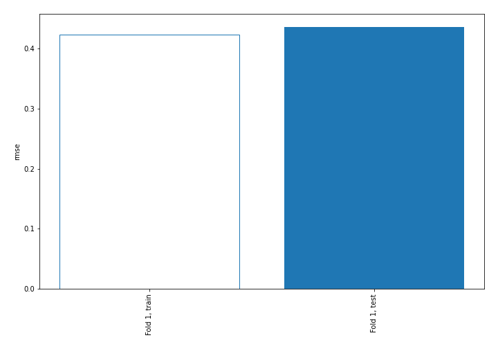
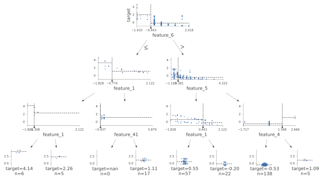
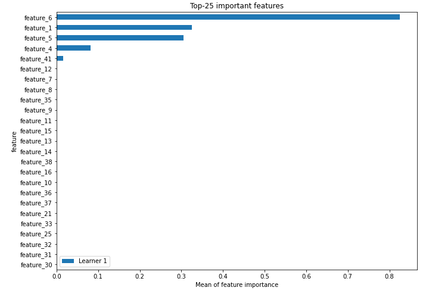
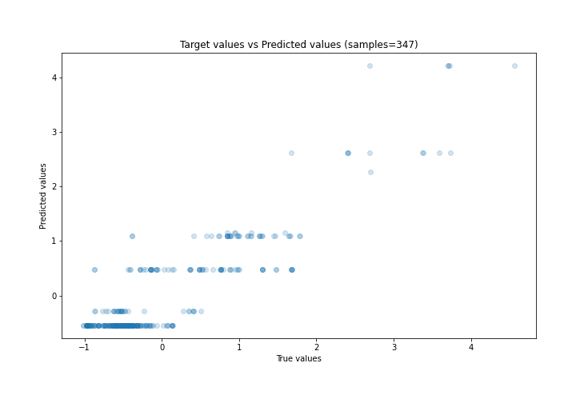
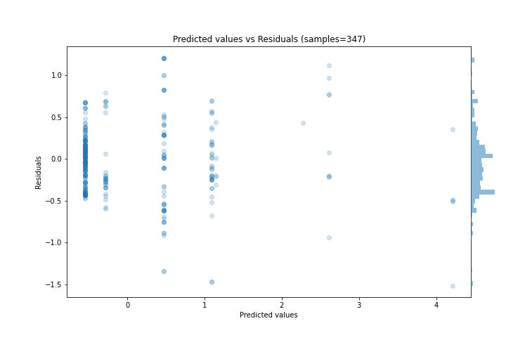
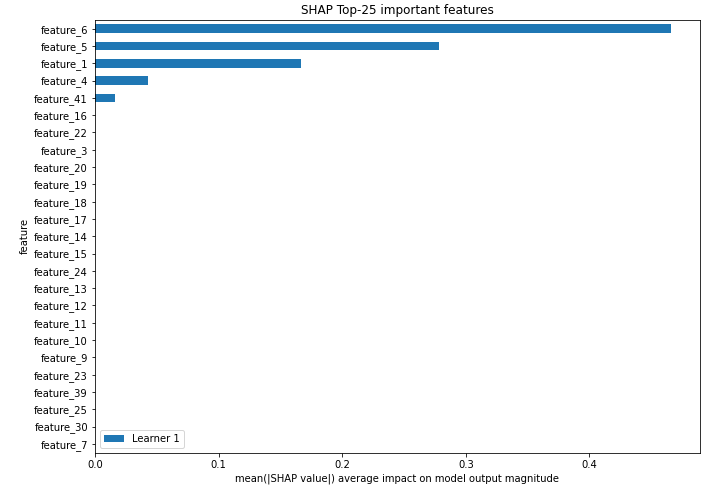
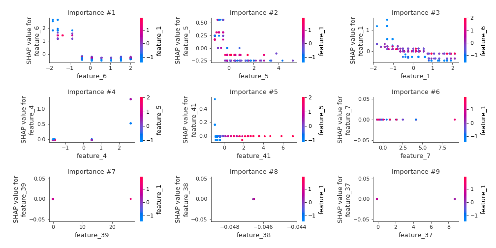
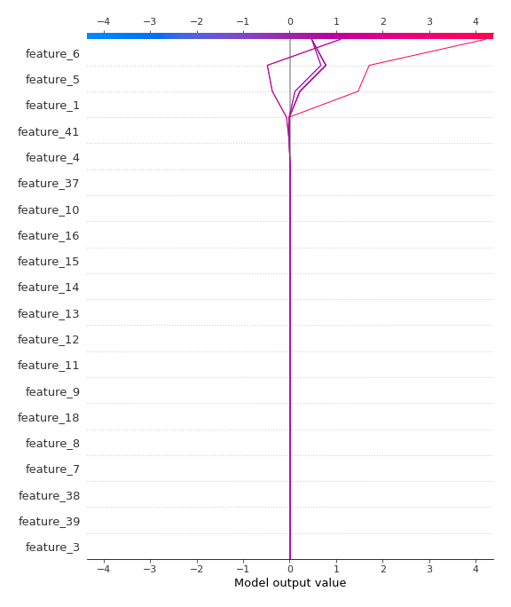
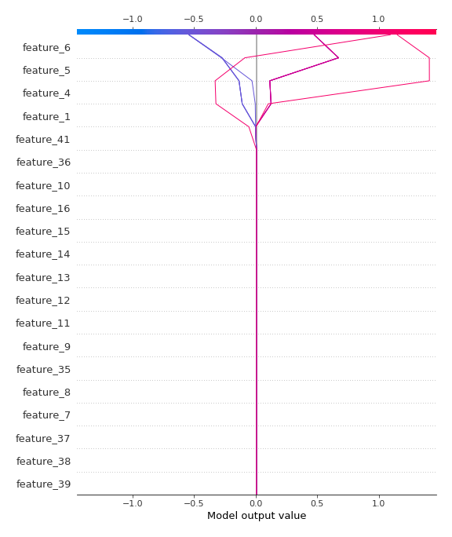

# Summary of 2_DecisionTree

[<< Go back](../README.md)

## Decision Tree
- **n_jobs**: -1
- **criterion**: mse
- **max_depth**: 3
- **explain_level**: 2

## Validation
 - **validation_type**: split
 - **train_ratio**: 0.75
 - **shuffle**: True

## Optimized metric
rmse

## Training time

7.9 seconds

### Metric details:
| Metric   |    Score |
|:---------|---------:|
| MAE      | 0.33108  |
| MSE      | 0.189927 |
| RMSE     | 0.435806 |
| R2       | 0.805012 |
| MAPE     | 0.989778 |

## Learning curves

## Decision Tree 

### Tree #1

### Rules

if (feature_6 > -0.643) and (feature_5 > -0.381) and (feature_4 <= 1.568) then response: -0.541 | based on 604 samples

if (feature_6 > -0.643) and (feature_5 <= -0.381) and (feature_1 <= 0.641) then response: 0.475 | based on 177 samples

if (feature_6 > -0.643) and (feature_5 <= -0.381) and (feature_1 > 0.641) then response: -0.282 | based on 98 samples

if (feature_6 <= -0.643) and (feature_1 > -0.774) and (feature_41 > -0.901) then response: 1.093 | based on 96 samples

if (feature_6 <= -0.643) and (feature_1 <= -0.774) and (feature_1 > -1.308) then response: 2.614 | based on 27 samples

if (feature_6 <= -0.643) and (feature_1 <= -0.774) and (feature_1 <= -1.308) then response: 4.211 | based on 15 samples

if (feature_6 > -0.643) and (feature_5 > -0.381) and (feature_4 > 1.568) then response: 1.15 | based on 12 samples

if (feature_6 <= -0.643) and (feature_1 > -0.774) and (feature_41 <= -0.901) then response: 2.27 | based on 11 samples

## Permutation-based Importance

## True vs Predicted

## Predicted vs Residuals

## SHAP Importance

## SHAP Dependence plots

### Dependence (Fold 1)

## SHAP Decision plots

### Top-10 Worst decisions (Fold 1)

### Top-10 Best decisions (Fold 1)

[<< Go back](../README.md)
