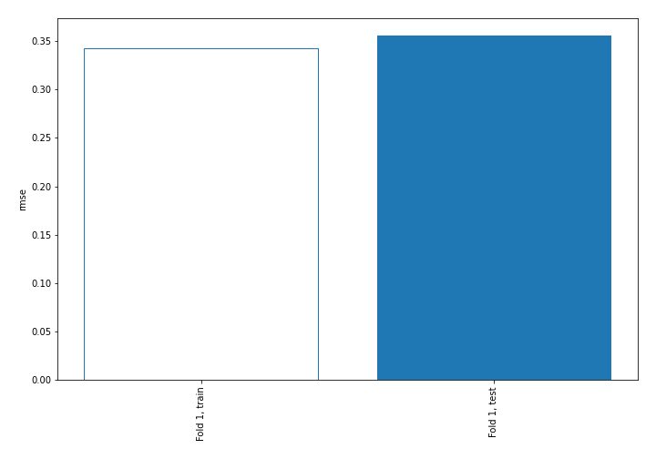
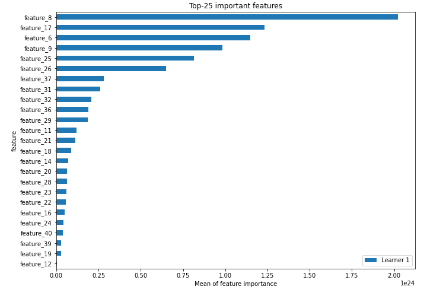
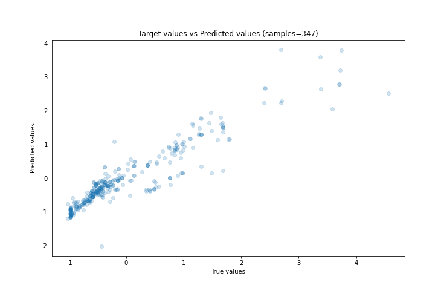
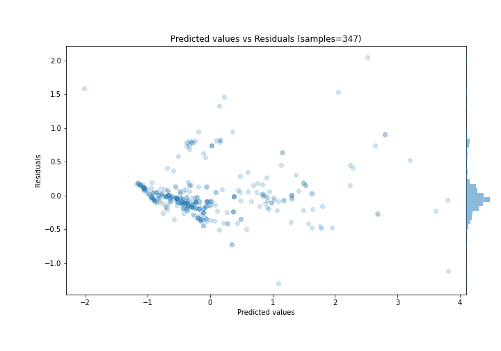
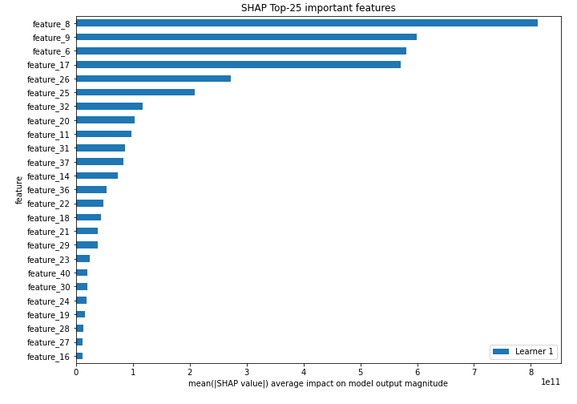
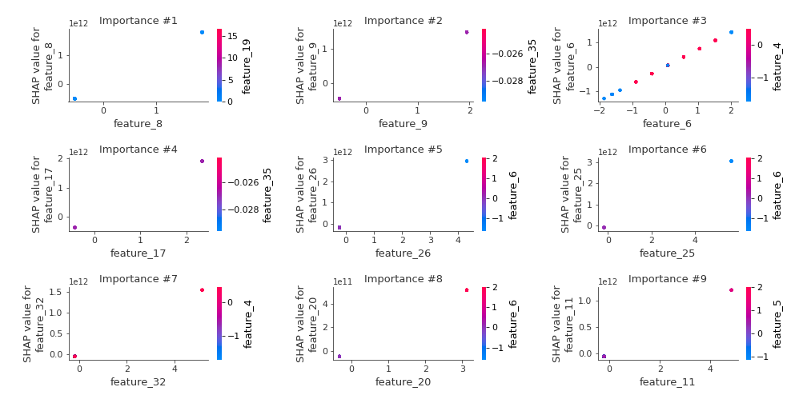
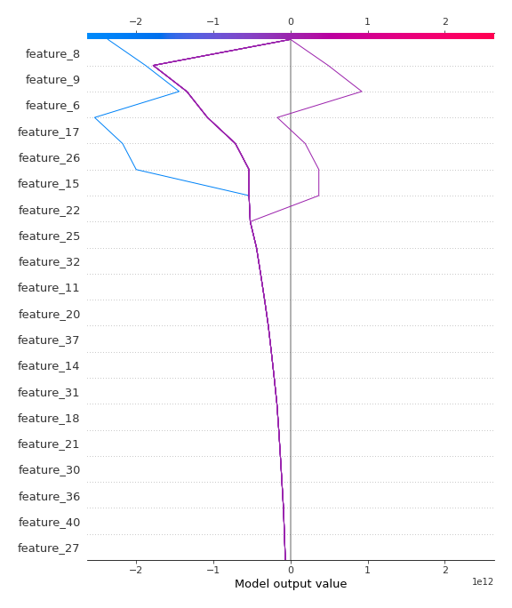
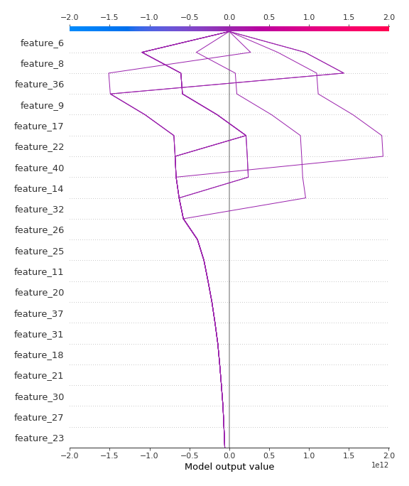

# Summary of 3_Linear

[<< Go back](../README.md)

## Linear Regression (Linear)
- **n_jobs**: -1
- **explain_level**: 2

## Validation
 - **validation_type**: split
 - **train_ratio**: 0.75
 - **shuffle**: True

## Optimized metric
rmse

## Training time

6.2 seconds

### Metric details:
| Metric   |    Score |
|:---------|---------:|
| MAE      | 0.222155 |
| MSE      | 0.126537 |
| RMSE     | 0.35572  |
| R2       | 0.870091 |
| MAPE     | 0.562053 |

## Learning curves

## Coefficients
| feature    |    Learner_1 |
|:-----------|-------------:|
| feature_8  |  9.46158e+11 |
| feature_17 |  8.17901e+11 |
| feature_9  |  7.82792e+11 |
| feature_6  |  7.03879e+11 |
| feature_26 |  6.87509e+11 |
| feature_25 |  5.34573e+11 |
| feature_37 |  3.53069e+11 |
| feature_31 |  3.18682e+11 |
| feature_32 |  2.95931e+11 |
| feature_36 |  2.61637e+11 |
| feature_21 |  2.50477e+11 |
| feature_11 |  2.47413e+11 |
| feature_18 |  2.26765e+11 |
| feature_29 |  2.15973e+11 |
| feature_30 |  2.09017e+11 |
| feature_14 |  1.81188e+11 |
| feature_40 |  1.71191e+11 |
| feature_27 |  1.67287e+11 |
| feature_20 |  1.64178e+11 |
| feature_23 |  1.60755e+11 |
| feature_19 |  1.35962e+11 |
| feature_22 |  1.33802e+11 |
| feature_24 |  1.26494e+11 |
| feature_28 |  1.24873e+11 |
| feature_16 |  1.11927e+11 |
| feature_38 |  1.05392e+11 |
| feature_39 |  8.60829e+10 |
| feature_35 |  8.37342e+10 |
| feature_10 |  7.31369e+10 |
| feature_13 |  7.31369e+10 |
| feature_12 |  5.94052e+10 |
| feature_33 |  2.42959e+10 |
| feature_4  |  0.340502    |
| feature_3  |  0.192572    |
| feature_7  |  0.171925    |
| feature_41 |  0.0120358   |
| feature_5  | -0.236689    |
| feature_1  | -0.313963    |
| intercept  | -1.70723e+09 |
| feature_15 | -3.92627e+10 |

## Permutation-based Importance

## True vs Predicted

## Predicted vs Residuals

## SHAP Importance

## SHAP Dependence plots

### Dependence (Fold 1)

## SHAP Decision plots

### Top-10 Worst decisions (Fold 1)

### Top-10 Best decisions (Fold 1)

[<< Go back](../README.md)
