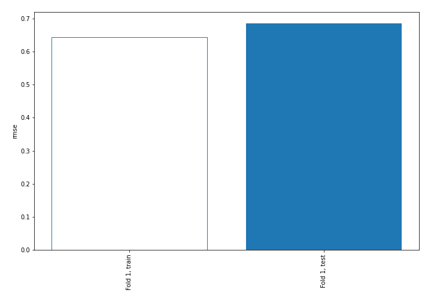
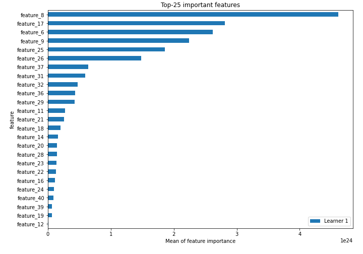
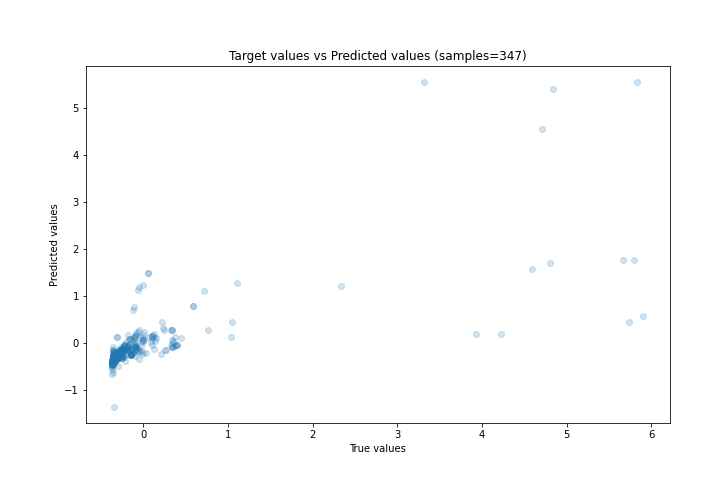
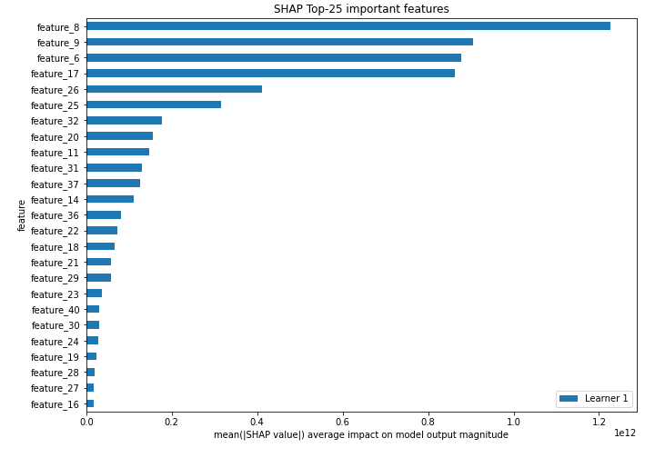
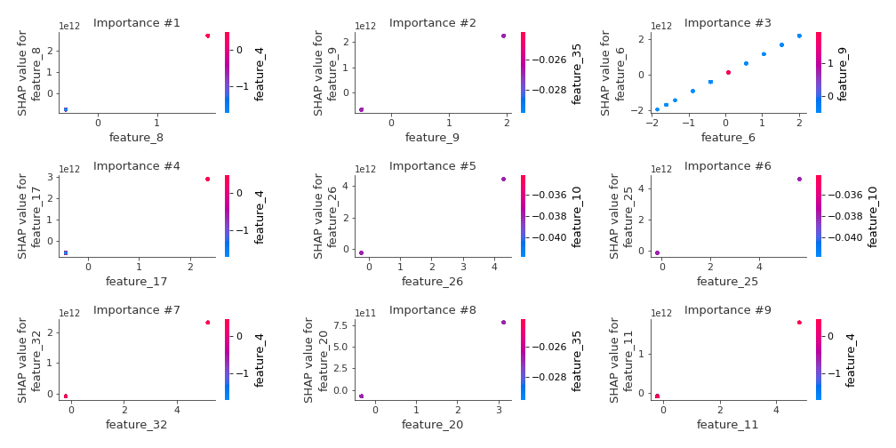
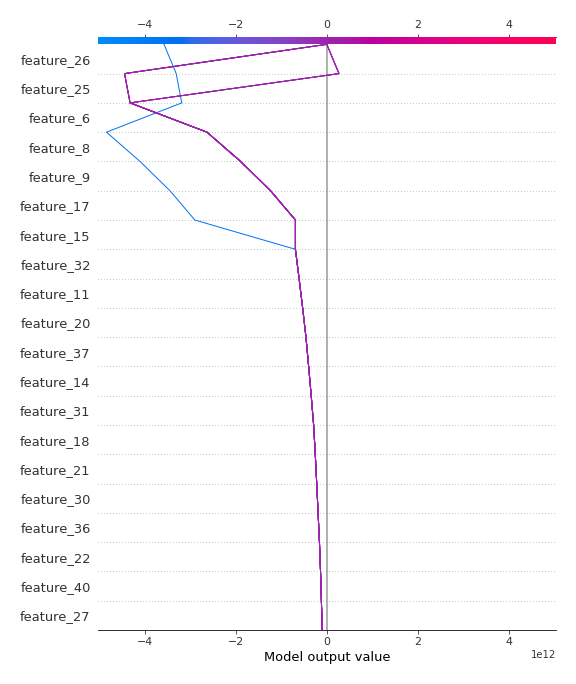
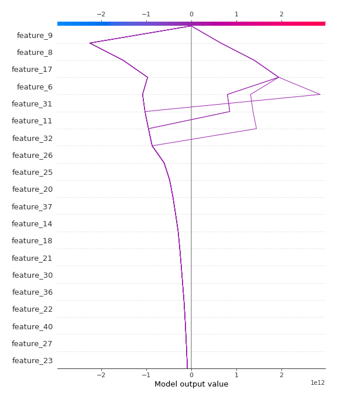

# Summary of 3_Linear

[<< Go back](../README.md)

## Linear Regression (Linear)
- **n_jobs**: -1
- **explain_level**: 2

## Validation
 - **validation_type**: split
 - **train_ratio**: 0.75
 - **shuffle**: True

## Optimized metric
rmse

## Training time

6.6 seconds

### Metric details:
| Metric   |    Score |
|:---------|---------:|
| MAE      | 0.23273  |
| MSE      | 0.469941 |
| RMSE     | 0.685523 |
| R2       | 0.517201 |
| MAPE     | 3.30074  |

## Learning curves

## Coefficients
| feature    |    Learner_1 |
|:-----------|-------------:|
| feature_8  |  1.42912e+12 |
| feature_17 |  1.23539e+12 |
| feature_9  |  1.18236e+12 |
| feature_6  |  1.06317e+12 |
| feature_26 |  1.03844e+12 |
| feature_25 |  8.07441e+11 |
| feature_37 |  5.3329e+11  |
| feature_31 |  4.8135e+11  |
| feature_32 |  4.46987e+11 |
| feature_36 |  3.95187e+11 |
| feature_21 |  3.7833e+11  |
| feature_11 |  3.73703e+11 |
| feature_18 |  3.42516e+11 |
| feature_29 |  3.26215e+11 |
| feature_30 |  3.15708e+11 |
| feature_14 |  2.73673e+11 |
| feature_40 |  2.58575e+11 |
| feature_27 |  2.52677e+11 |
| feature_20 |  2.47982e+11 |
| feature_23 |  2.42812e+11 |
| feature_19 |  2.05362e+11 |
| feature_22 |  2.021e+11   |
| feature_24 |  1.91061e+11 |
| feature_28 |  1.88613e+11 |
| feature_16 |  1.69058e+11 |
| feature_38 |  1.59188e+11 |
| feature_39 |  1.30023e+11 |
| feature_35 |  1.26476e+11 |
| feature_10 |  1.10469e+11 |
| feature_13 |  1.10469e+11 |
| feature_12 |  8.97281e+10 |
| feature_33 |  3.66976e+10 |
| feature_3  |  0.255323    |
| feature_4  |  0.234553    |
| feature_5  |  0.226034    |
| feature_7  |  0.124247    |
| feature_1  | -0.197026    |
| feature_41 | -0.408121    |
| intercept  | -2.57868e+09 |
| feature_15 | -5.93041e+10 |

## Permutation-based Importance

## True vs Predicted

## Predicted vs Residuals

## SHAP Importance

## SHAP Dependence plots

### Dependence (Fold 1)

## SHAP Decision plots

### Top-10 Worst decisions (Fold 1)

### Top-10 Best decisions (Fold 1)

[<< Go back](../README.md)
