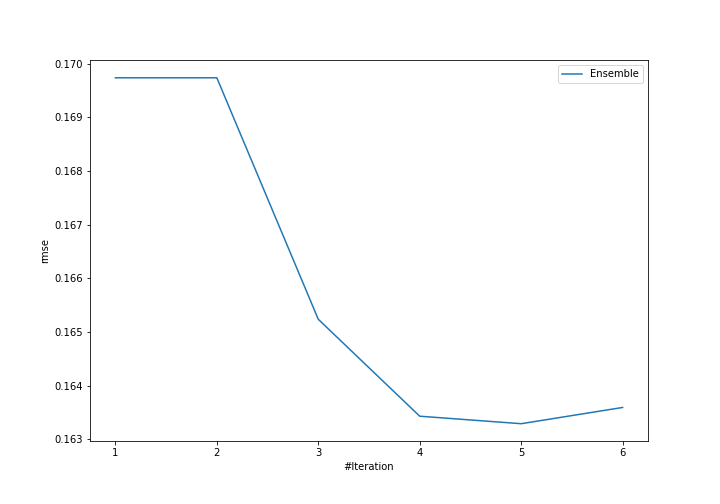
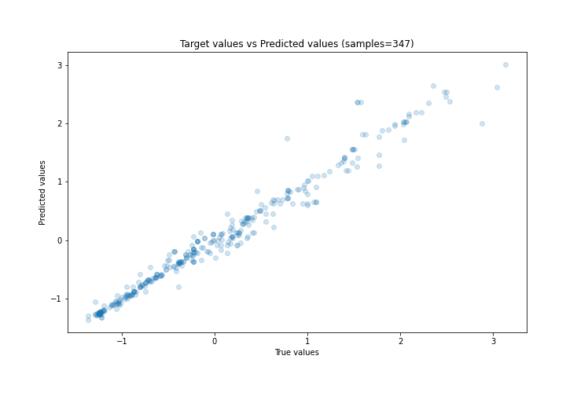
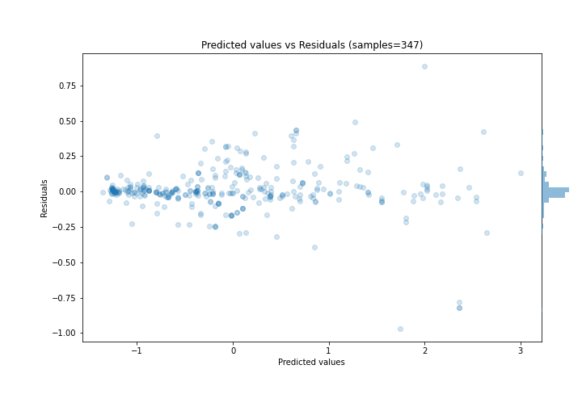

# Summary of Ensemble

[<< Go back](../README.md)

## Ensemble structure
| Model                   |   Weight |
|:------------------------|---------:|
| 4_Default_Xgboost       |        4 |
| 5_Default_NeuralNetwork |        1 |

### Metric details:
| Metric   |     Score |
|:---------|----------:|
| MAE      | 0.0907671 |
| MSE      | 0.0266628 |
| RMSE     | 0.163288  |
| R2       | 0.973052  |
| MAPE     | 0.378892  |

## Learning curves

## True vs Predicted

## Predicted vs Residuals

[<< Go back](../README.md)
