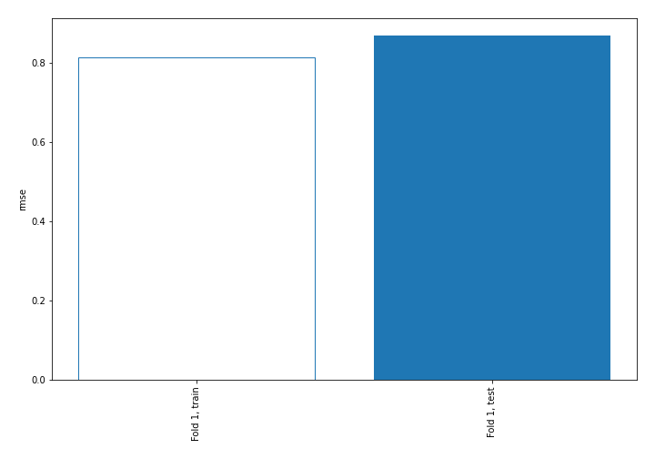

# Summary of 3_Linear

[<< Go back](../README.md)

## Linear Regression (Linear)
- **n_jobs**: -1
- **explain_level**: 2

## Validation
 - **validation_type**: split
 - **train_ratio**: 0.75
 - **shuffle**: True

## Optimized metric
rmse

## Training time

3.3 seconds

### Metric details:
| Metric   |     Score |
|:---------|----------:|
| MAE      |  0.513055 |
| MSE      |  0.755909 |
| RMSE     |  0.86943  |
| R2       |  0.255351 |
| MAPE     | 25.6228   |

## Learning curves

## Coefficients
| feature    |   Learner_1 |
|:-----------|------------:|
| feature_5  |  0.416861   |
| feature_7  |  0.189789   |
| feature_3  |  0.108799   |
| feature_8  |  0.0430822  |
| feature_9  |  0.0156243  |
| feature_12 |  0.0101692  |
| feature_13 |  0.00835815 |
| intercept  | -0.0124792  |
| feature_4  | -0.0293229  |
| feature_14 | -0.074604   |
| feature_11 | -0.0804314  |
| feature_10 | -0.196447   |
| feature_6  | -0.470275   |
| feature_1  | -0.572925   |

## Permutation-based Importance

## True vs Predicted

## Predicted vs Residuals

## SHAP Importance

## SHAP Dependence plots

### Dependence (Fold 1)

## SHAP Decision plots

### Top-10 Worst decisions (Fold 1)

### Top-10 Best decisions (Fold 1)

[<< Go back](../README.md)
