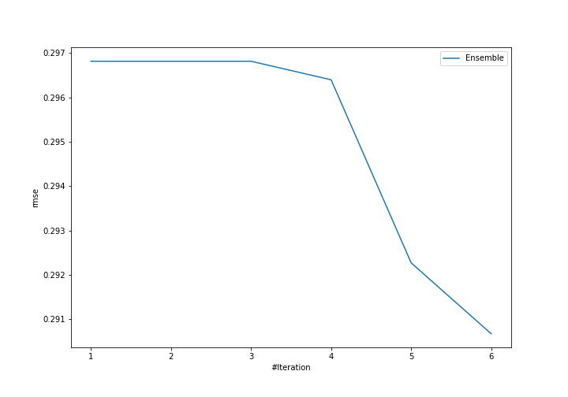
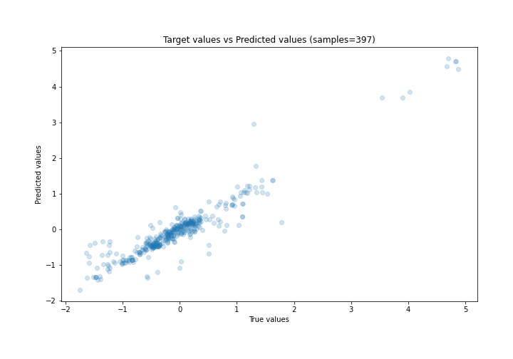
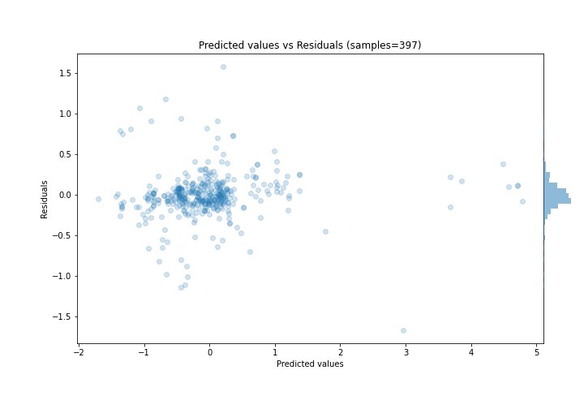

# Summary of Ensemble

[<< Go back](../README.md)

## Ensemble structure
| Model             |   Weight |
|:------------------|---------:|
| 2_DecisionTree    |        1 |
| 4_Default_Xgboost |        5 |

### Metric details:
| Metric   |     Score |
|:---------|----------:|
| MAE      | 0.175506  |
| MSE      | 0.0844883 |
| RMSE     | 0.290669  |
| R2       | 0.896223  |
| MAPE     | 6.54625   |

## Learning curves

## True vs Predicted

## Predicted vs Residuals

[<< Go back](../README.md)
