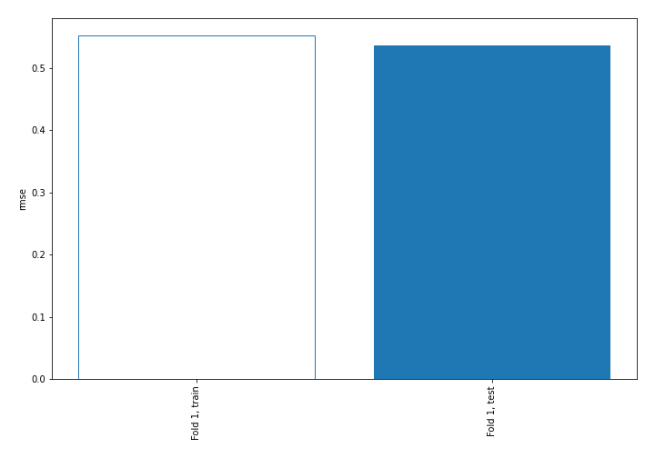
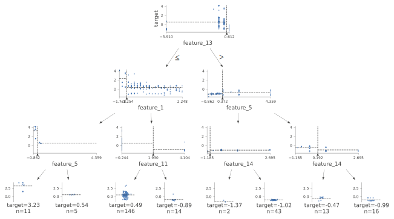
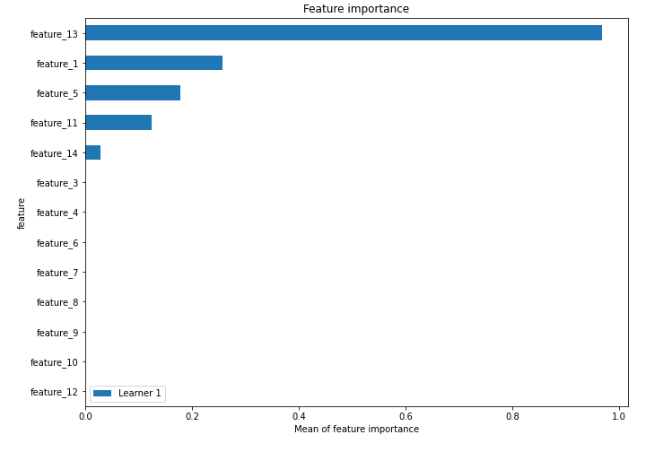
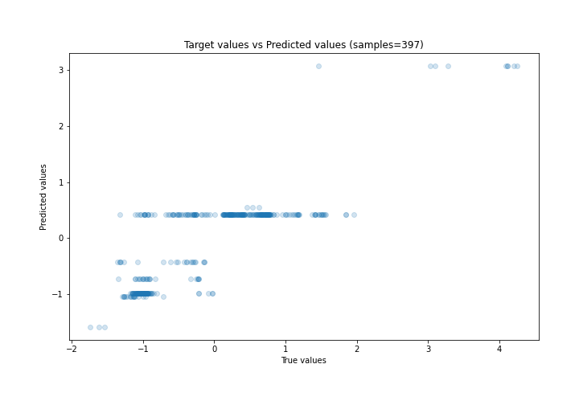
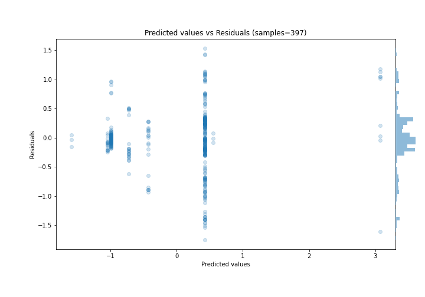
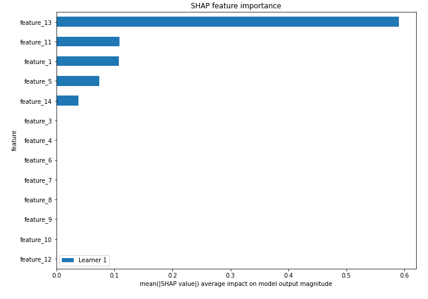
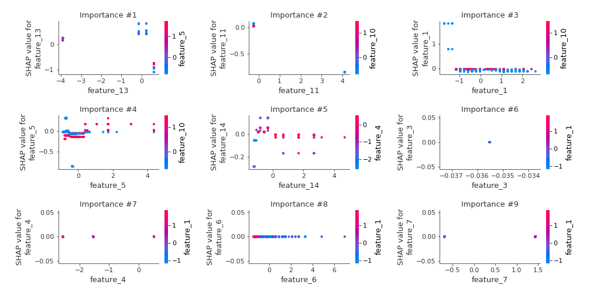
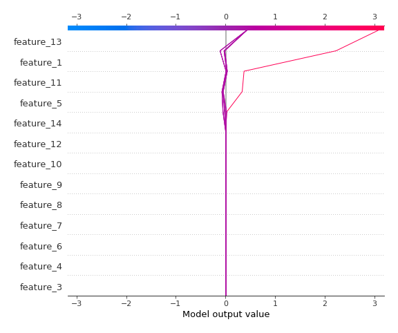
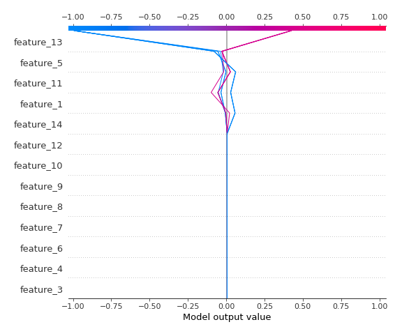

# Summary of 2_DecisionTree

[<< Go back](../README.md)

## Decision Tree
- **n_jobs**: -1
- **criterion**: mse
- **max_depth**: 3
- **explain_level**: 2

## Validation
 - **validation_type**: split
 - **train_ratio**: 0.75
 - **shuffle**: True

## Optimized metric
rmse

## Training time

5.1 seconds

### Metric details:
| Metric   |    Score |
|:---------|---------:|
| MAE      | 0.372963 |
| MSE      | 0.2872   |
| RMSE     | 0.535911 |
| R2       | 0.700621 |
| MAPE     | 0.975855 |

## Learning curves

## Decision Tree 

### Tree #1

### Rules

if (feature_13 <= 0.424) and (feature_1 > -1.254) and (feature_11 <= 1.93) then response: 0.425 | based on 688 samples

if (feature_13 > 0.424) and (feature_5 <= 0.372) and (feature_14 > -0.998) then response: -0.991 | based on 226 samples

if (feature_13 > 0.424) and (feature_5 > 0.372) and (feature_14 <= 0.192) then response: -0.427 | based on 83 samples

if (feature_13 <= 0.424) and (feature_1 > -1.254) and (feature_11 > 1.93) then response: -0.725 | based on 66 samples

if (feature_13 > 0.424) and (feature_5 > 0.372) and (feature_14 > 0.192) then response: -1.048 | based on 61 samples

if (feature_13 <= 0.424) and (feature_1 <= -1.254) and (feature_5 <= -0.512) then response: 3.073 | based on 35 samples

if (feature_13 > 0.424) and (feature_5 <= 0.372) and (feature_14 <= -0.998) then response: -1.586 | based on 18 samples

if (feature_13 <= 0.424) and (feature_1 <= -1.254) and (feature_5 > -0.512) then response: 0.546 | based on 14 samples

## Permutation-based Importance

## True vs Predicted

## Predicted vs Residuals

## SHAP Importance

## SHAP Dependence plots

### Dependence (Fold 1)

## SHAP Decision plots

### Top-10 Worst decisions (Fold 1)

### Top-10 Best decisions (Fold 1)

[<< Go back](../README.md)
