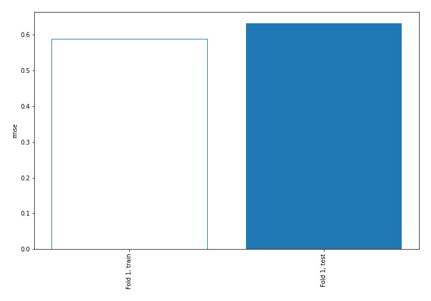
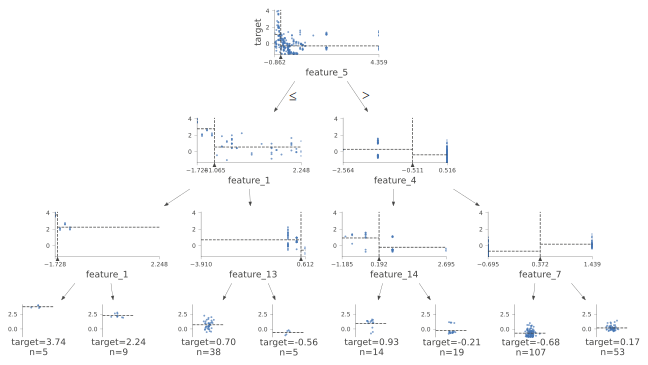
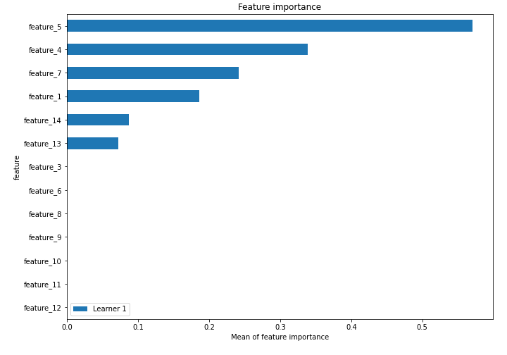
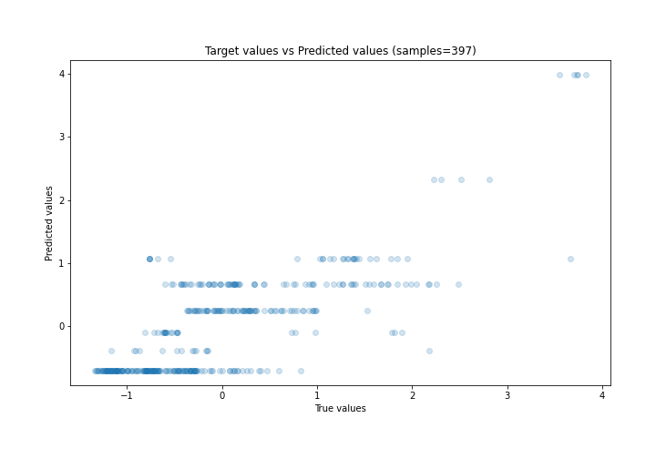
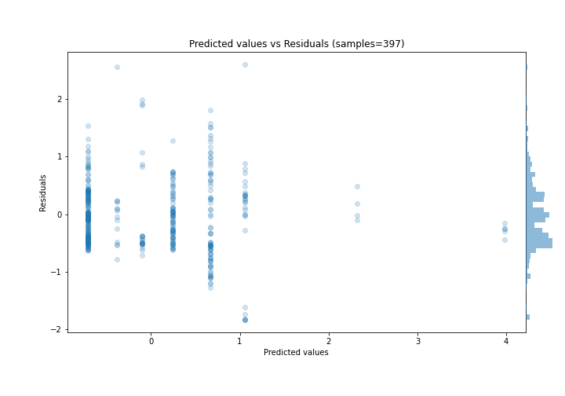
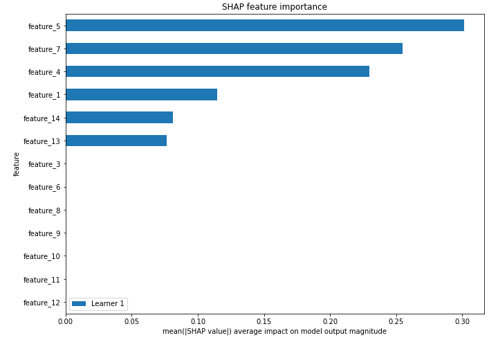
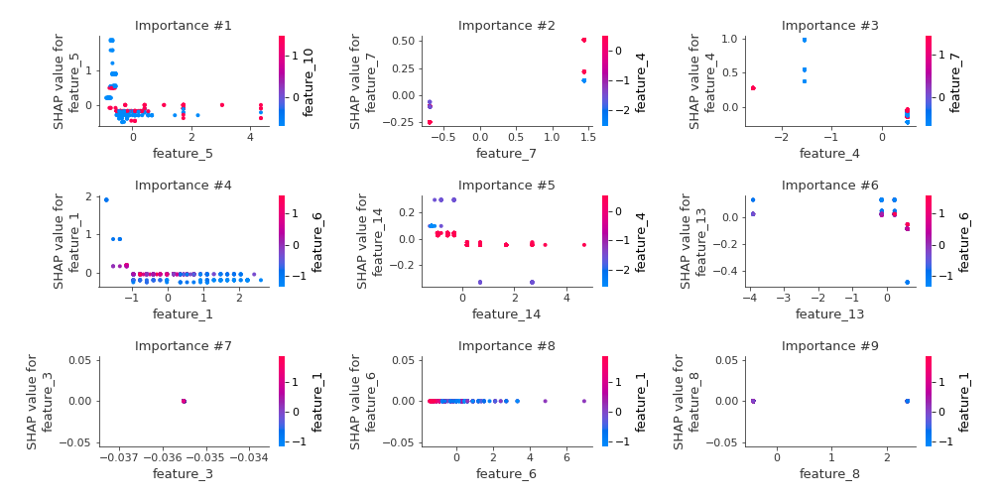
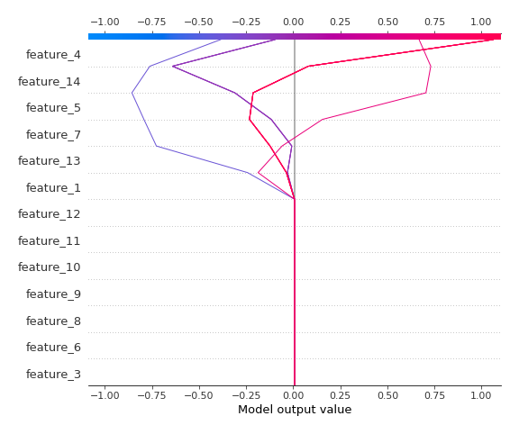
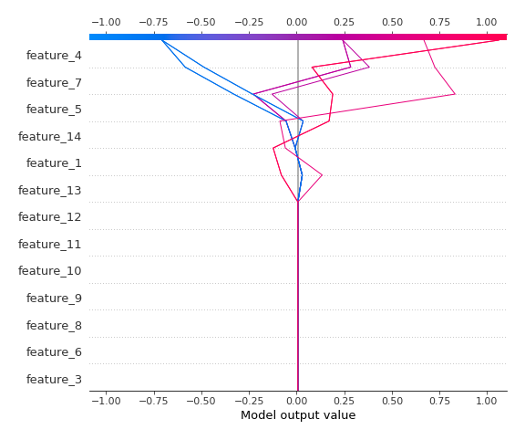

# Summary of 2_DecisionTree

[<< Go back](../README.md)

## Decision Tree
- **n_jobs**: -1
- **criterion**: mse
- **max_depth**: 3
- **explain_level**: 2

## Validation
 - **validation_type**: split
 - **train_ratio**: 0.75
 - **shuffle**: True

## Optimized metric
rmse

## Training time

5.3 seconds

### Metric details:
| Metric   |    Score |
|:---------|---------:|
| MAE      | 0.481189 |
| MSE      | 0.400043 |
| RMSE     | 0.63249  |
| R2       | 0.595341 |
| MAPE     | 3.55014  |

## Learning curves

## Decision Tree 

### Tree #1

### Rules

if (feature_5 > -0.558) and (feature_4 > -0.511) and (feature_7 <= 0.372) then response: -0.707 | based on 500 samples

if (feature_5 > -0.558) and (feature_4 > -0.511) and (feature_7 > 0.372) then response: 0.243 | based on 249 samples

if (feature_5 <= -0.558) and (feature_1 > -1.065) and (feature_13 <= 0.424) then response: 0.669 | based on 186 samples

if (feature_5 > -0.558) and (feature_4 <= -0.511) and (feature_14 <= 0.192) then response: 1.061 | based on 89 samples

if (feature_5 > -0.558) and (feature_4 <= -0.511) and (feature_14 > 0.192) then response: -0.097 | based on 79 samples

if (feature_5 <= -0.558) and (feature_1 > -1.065) and (feature_13 > 0.424) then response: -0.386 | based on 49 samples

if (feature_5 <= -0.558) and (feature_1 <= -1.065) and (feature_1 > -1.633) then response: 2.321 | based on 28 samples

if (feature_5 <= -0.558) and (feature_1 <= -1.065) and (feature_1 <= -1.633) then response: 3.985 | based on 11 samples

## Permutation-based Importance

## True vs Predicted

## Predicted vs Residuals

## SHAP Importance

## SHAP Dependence plots

### Dependence (Fold 1)

## SHAP Decision plots

### Top-10 Worst decisions (Fold 1)

### Top-10 Best decisions (Fold 1)

[<< Go back](../README.md)
