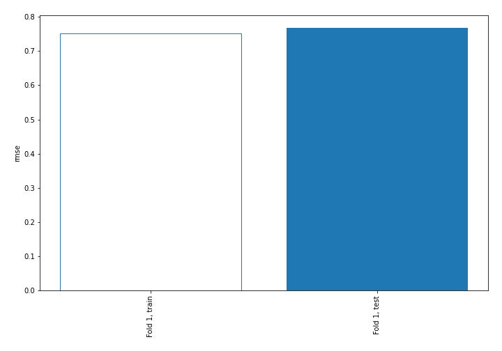
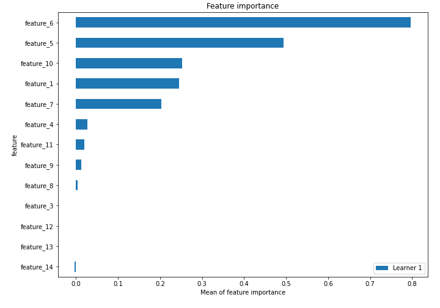
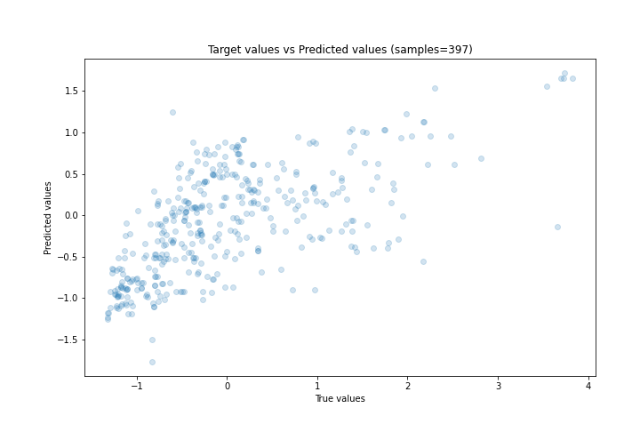
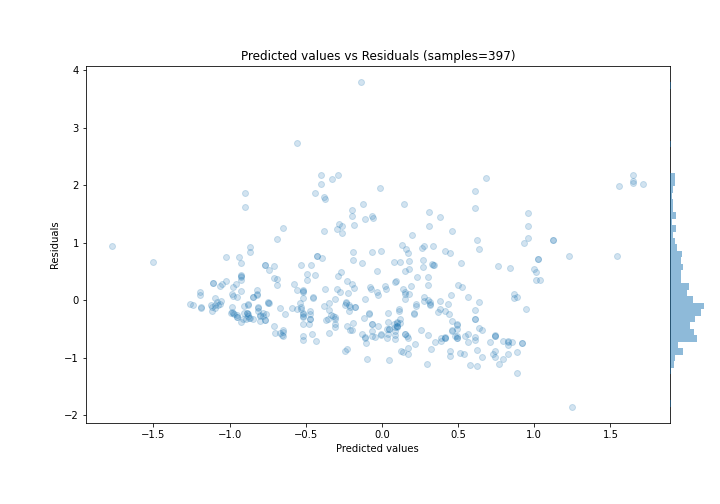
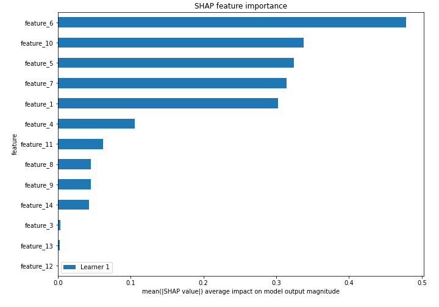
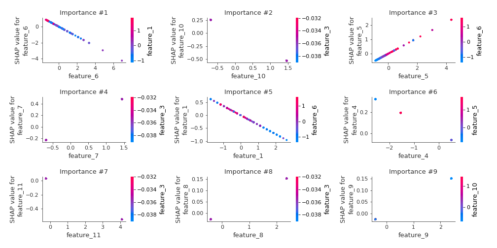
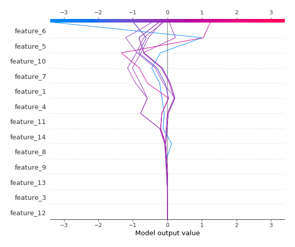

# Summary of 3_Linear

[<< Go back](../README.md)

## Linear Regression (Linear)
- **n_jobs**: -1
- **explain_level**: 2

## Validation
 - **validation_type**: split
 - **train_ratio**: 0.75
 - **shuffle**: True

## Optimized metric
rmse

## Training time

3.8 seconds

### Metric details:
| Metric   |    Score |
|:---------|---------:|
| MAE      | 0.571789 |
| MSE      | 0.587853 |
| RMSE     | 0.766716 |
| R2       | 0.405238 |
| MAPE     | 3.55361  |

## Learning curves

## Coefficients
| feature    |   Learner_1 |
|:-----------|------------:|
| feature_5  |  0.549976   |
| feature_7  |  0.334384   |
| feature_3  |  0.0682575  |
| feature_8  |  0.0638729  |
| feature_9  |  0.0623007  |
| feature_13 |  0.00568597 |
| intercept  | -0.00192114 |
| feature_12 | -0.00608468 |
| feature_14 | -0.0530561  |
| feature_4  | -0.126201   |
| feature_11 | -0.135275   |
| feature_1  | -0.361141   |
| feature_10 | -0.365198   |
| feature_6  | -0.616835   |

## Permutation-based Importance

## True vs Predicted

## Predicted vs Residuals

## SHAP Importance

## SHAP Dependence plots

### Dependence (Fold 1)

## SHAP Decision plots

### Top-10 Worst decisions (Fold 1)

### Top-10 Best decisions (Fold 1)

[<< Go back](../README.md)
