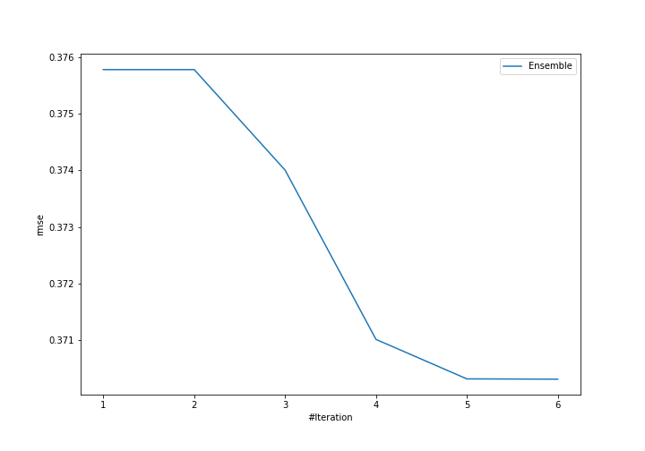
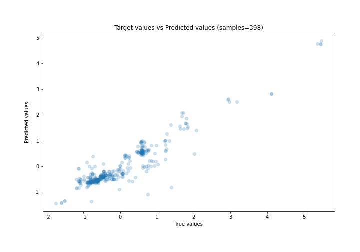
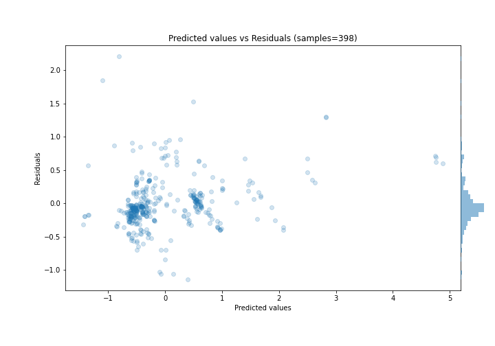

# Summary of Ensemble

[<< Go back](../README.md)

## Ensemble structure
| Model                   |   Weight |
|:------------------------|---------:|
| 4_Default_Xgboost       |        5 |
| 5_Default_NeuralNetwork |        1 |

### Metric details:
| Metric   |    Score |
|:---------|---------:|
| MAE      | 0.249625 |
| MSE      | 0.137132 |
| RMSE     | 0.370314 |
| R2       | 0.866328 |
| MAPE     | 0.796855 |

## Learning curves

## True vs Predicted

## Predicted vs Residuals

[<< Go back](../README.md)
