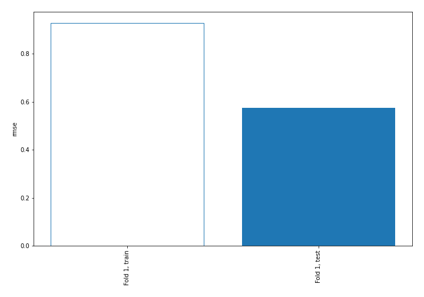
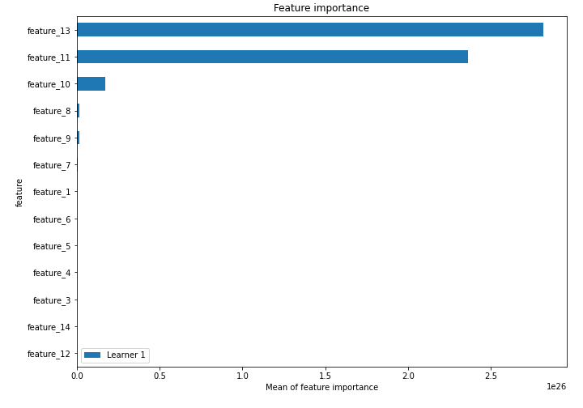
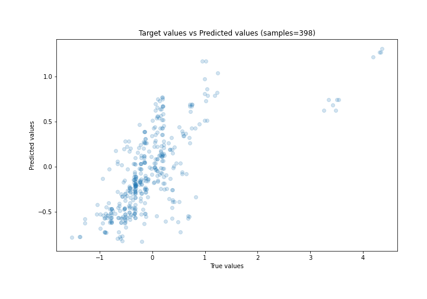
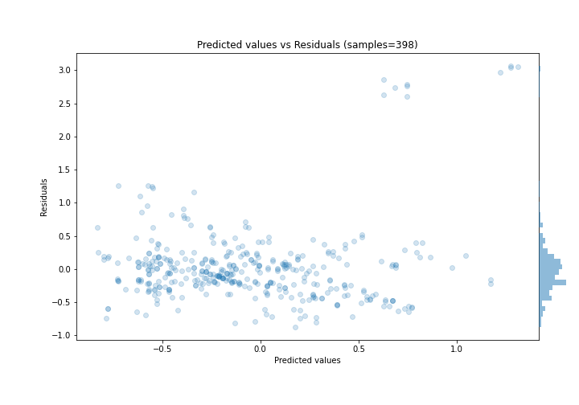
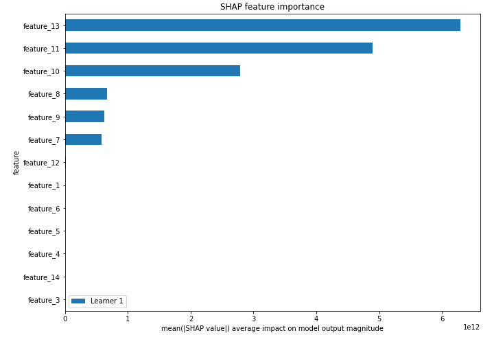
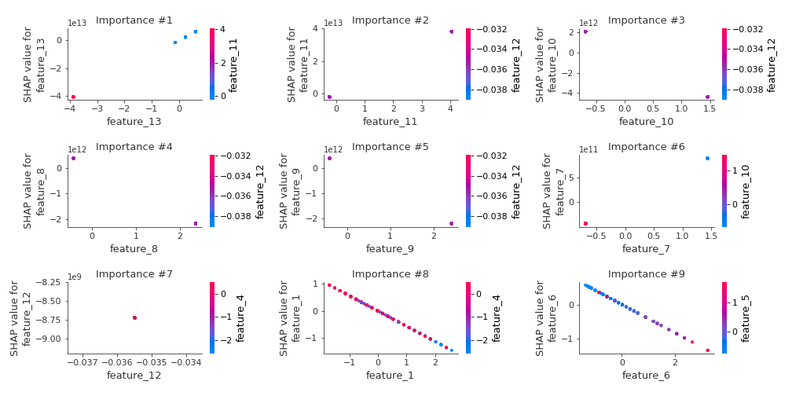
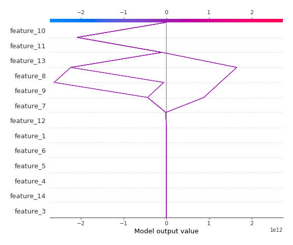
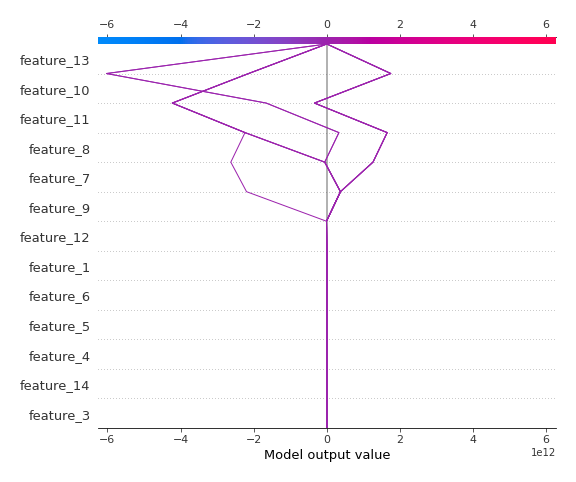

# Summary of 3_Linear

[<< Go back](../README.md)

## Linear Regression (Linear)
- **n_jobs**: -1
- **explain_level**: 2

## Validation
 - **validation_type**: split
 - **train_ratio**: 0.75
 - **shuffle**: True

## Optimized metric
rmse

## Training time

4.6 seconds

### Metric details:
| Metric   |    Score |
|:---------|---------:|
| MAE      | 0.335763 |
| MSE      | 0.330571 |
| RMSE     | 0.574953 |
| R2       | 0.450444 |
| MAPE     | 6.82174  |

## Learning curves

## Coefficients
| feature    |    Learner_1 |
|:-----------|-------------:|
| feature_13 |  1.04009e+13 |
| feature_11 |  9.32909e+12 |
| feature_7  |  6.18366e+11 |
| feature_12 |  1.84159e+11 |
| feature_5  |  0.40704     |
| feature_4  |  0.251599    |
| feature_3  |  0.068891    |
| intercept  | -0.00806971  |
| feature_14 | -0.0484329   |
| feature_6  | -0.412237    |
| feature_1  | -0.559359    |
| feature_9  | -9.05514e+11 |
| feature_8  | -9.21494e+11 |
| feature_10 | -3.0101e+12  |

## Permutation-based Importance

## True vs Predicted

## Predicted vs Residuals

## SHAP Importance

## SHAP Dependence plots

### Dependence (Fold 1)

## SHAP Decision plots

### Top-10 Worst decisions (Fold 1)

### Top-10 Best decisions (Fold 1)

[<< Go back](../README.md)
