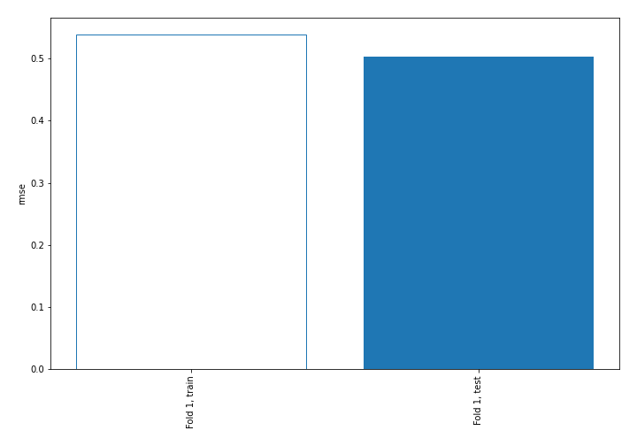
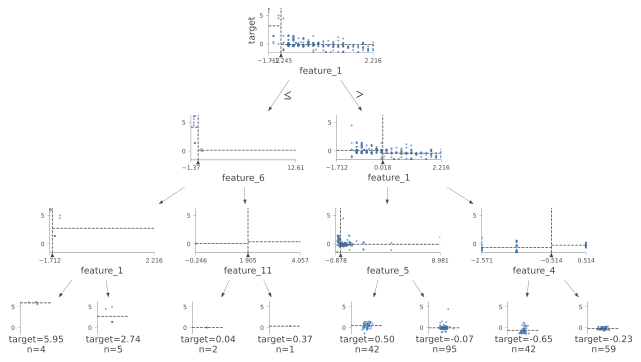
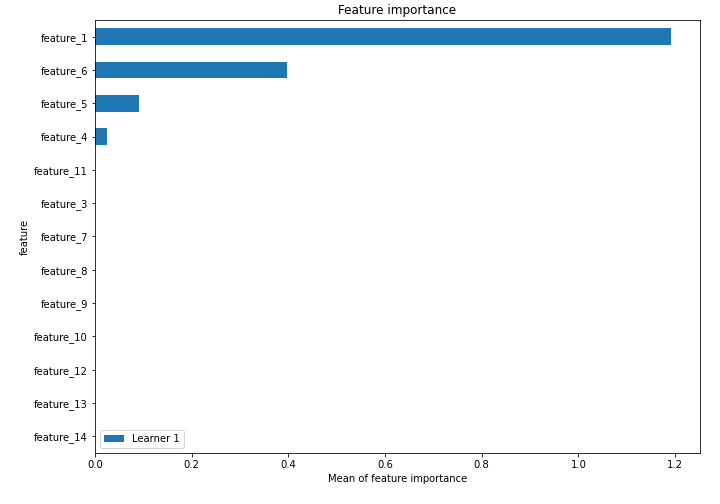
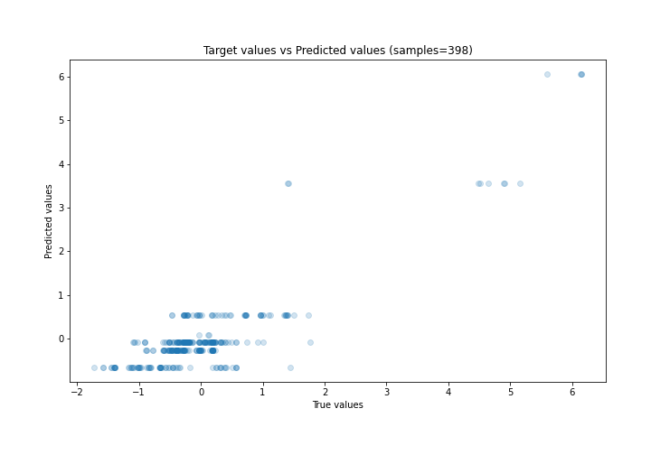
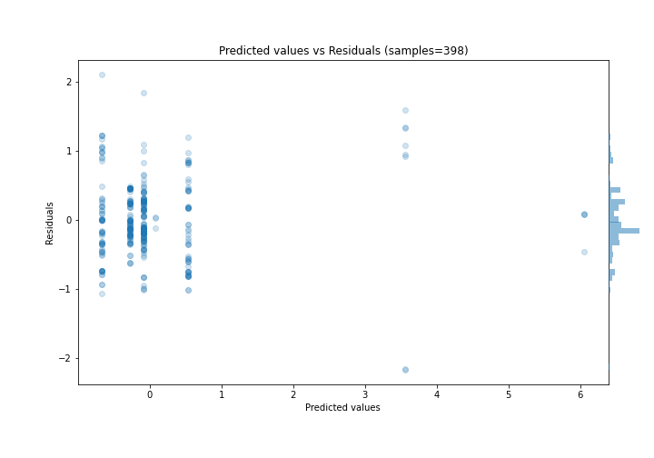
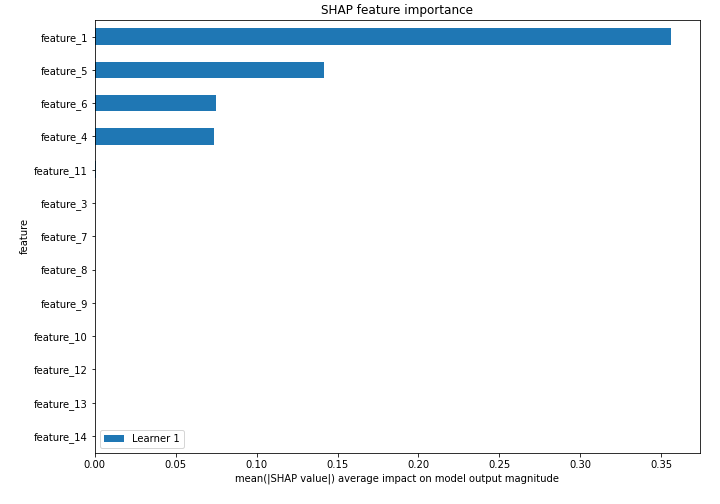
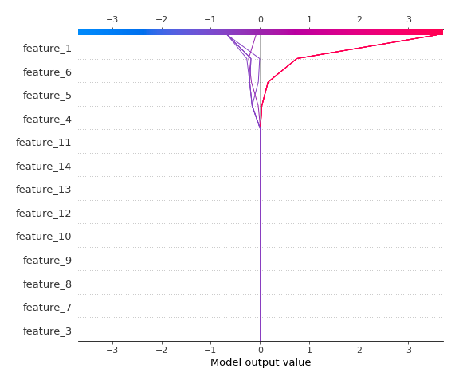
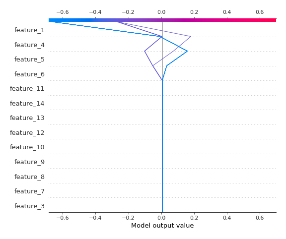

# Summary of 2_DecisionTree

[<< Go back](../README.md)

## Decision Tree
- **n_jobs**: -1
- **criterion**: mse
- **max_depth**: 3
- **explain_level**: 2

## Validation
 - **validation_type**: split
 - **train_ratio**: 0.75
 - **shuffle**: True

## Optimized metric
rmse

## Training time

6.1 seconds

### Metric details:
| Metric   |    Score |
|:---------|---------:|
| MAE      | 0.369953 |
| MSE      | 0.253629 |
| RMSE     | 0.503616 |
| R2       | 0.756471 |
| MAPE     | 2.49151  |

## Learning curves

## Decision Tree 

### Tree #1

### Rules

if (feature_1 > -1.245) and (feature_1 <= 0.018) and (feature_5 > -0.425) then response: -0.085 | based on 484 samples

if (feature_1 > -1.245) and (feature_1 > 0.018) and (feature_4 > -0.514) then response: -0.267 | based on 287 samples

if (feature_1 > -1.245) and (feature_1 <= 0.018) and (feature_5 <= -0.425) then response: 0.535 | based on 191 samples

if (feature_1 > -1.245) and (feature_1 > 0.018) and (feature_4 <= -0.514) then response: -0.66 | based on 182 samples

if (feature_1 <= -1.245) and (feature_6 <= -0.42) and (feature_1 > -1.619) then response: 3.565 | based on 21 samples

if (feature_1 <= -1.245) and (feature_6 > -0.42) and (feature_11 <= 1.905) then response: 0.088 | based on 14 samples

if (feature_1 <= -1.245) and (feature_6 <= -0.42) and (feature_1 <= -1.619) then response: 6.058 | based on 11 samples

if (feature_1 <= -1.245) and (feature_6 > -0.42) and (feature_11 > 1.905) then response: 0.374 | based on 1 samples

## Permutation-based Importance

## True vs Predicted

## Predicted vs Residuals

## SHAP Importance

## SHAP Dependence plots

### Dependence (Fold 1)

## SHAP Decision plots

### Top-10 Worst decisions (Fold 1)

### Top-10 Best decisions (Fold 1)

[<< Go back](../README.md)
