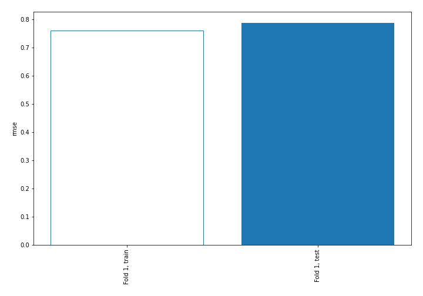
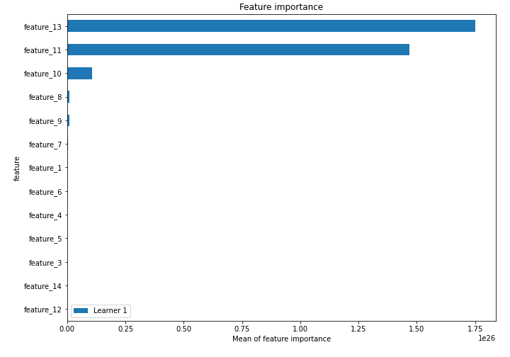
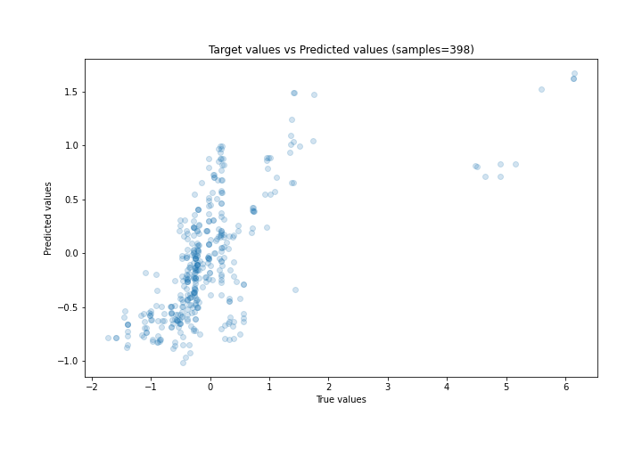
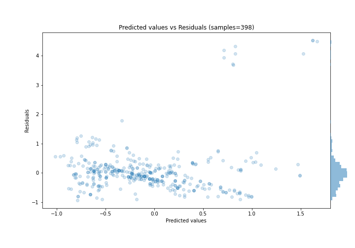
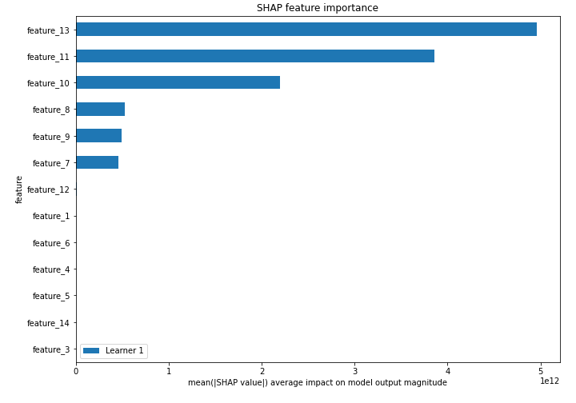
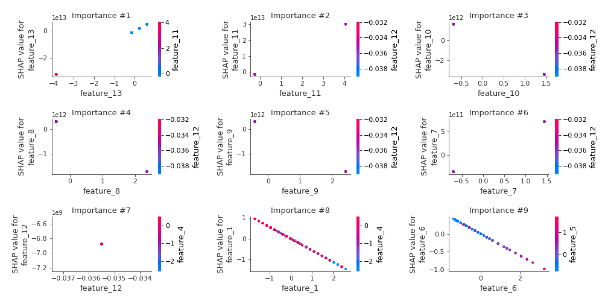
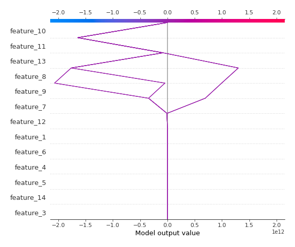
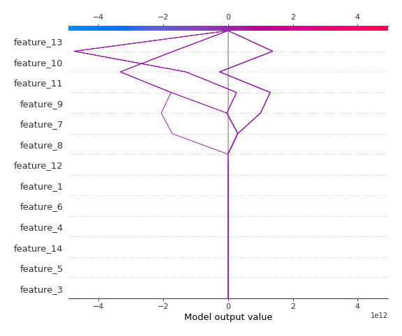

# Summary of 3_Linear

[<< Go back](../README.md)

## Linear Regression (Linear)
- **n_jobs**: -1
- **explain_level**: 2

## Validation
 - **validation_type**: split
 - **train_ratio**: 0.75
 - **shuffle**: True

## Optimized metric
rmse

## Training time

4.6 seconds

### Metric details:
| Metric   |    Score |
|:---------|---------:|
| MAE      | 0.427663 |
| MSE      | 0.618937 |
| RMSE     | 0.786725 |
| R2       | 0.405712 |
| MAPE     | 2.36544  |

## Learning curves

## Coefficients
| feature    |    Learner_1 |
|:-----------|-------------:|
| feature_13 |  8.19827e+12 |
| feature_11 |  7.35344e+12 |
| feature_7  |  4.87413e+11 |
| feature_12 |  1.45159e+11 |
| feature_4  |  0.232884    |
| feature_5  |  0.143139    |
| feature_3  |  0.0712638   |
| intercept  | -0.00512861  |
| feature_14 | -0.06927     |
| feature_6  | -0.303928    |
| feature_1  | -0.562269    |
| feature_9  | -7.1375e+11  |
| feature_8  | -7.26347e+11 |
| feature_10 | -2.37264e+12 |

## Permutation-based Importance

## True vs Predicted

## Predicted vs Residuals

## SHAP Importance

## SHAP Dependence plots

### Dependence (Fold 1)

## SHAP Decision plots

### Top-10 Worst decisions (Fold 1)

### Top-10 Best decisions (Fold 1)

[<< Go back](../README.md)
