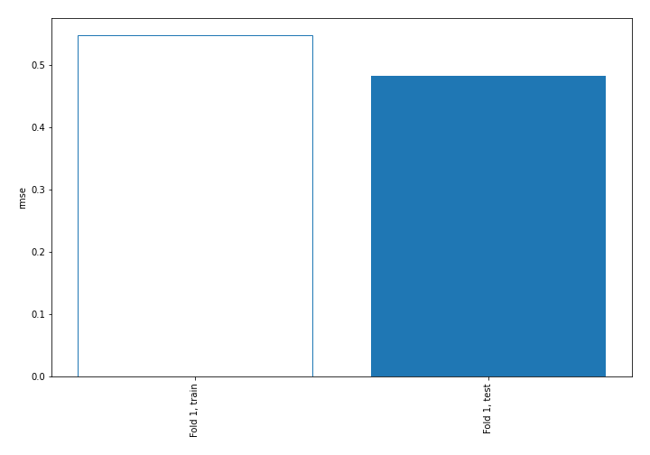
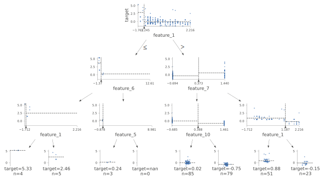
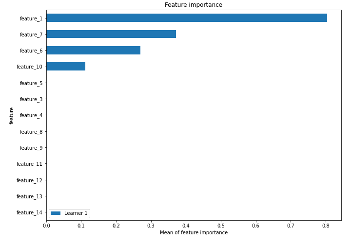
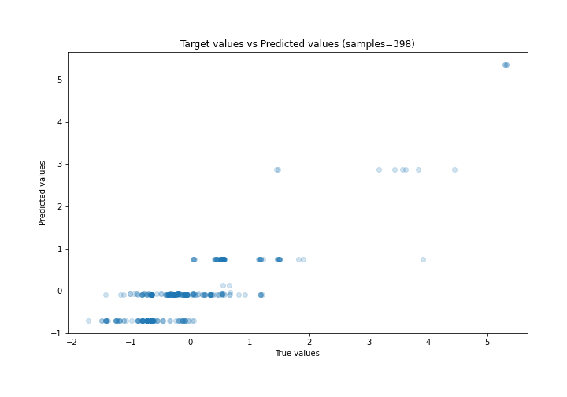
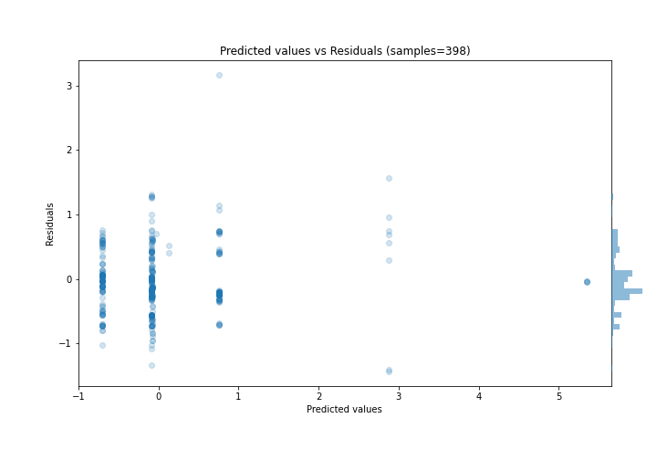
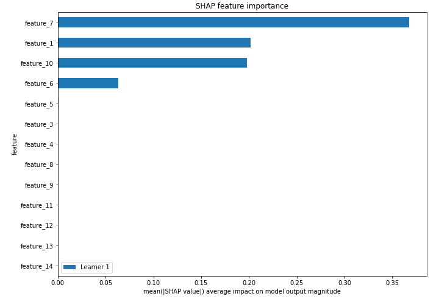
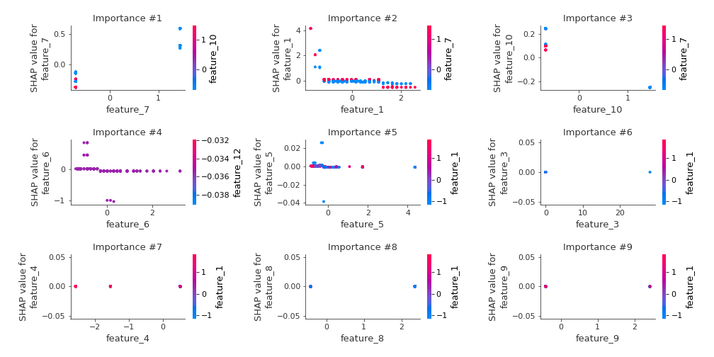
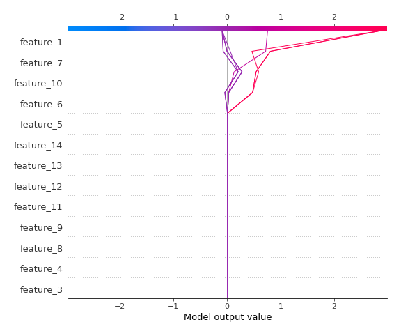
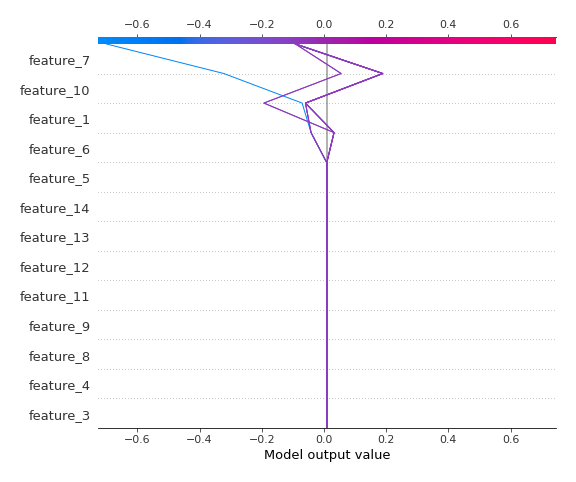

# Summary of 2_DecisionTree

[<< Go back](../README.md)

## Decision Tree
- **n_jobs**: -1
- **criterion**: mse
- **max_depth**: 3
- **explain_level**: 2

## Validation
 - **validation_type**: split
 - **train_ratio**: 0.75
 - **shuffle**: True

## Optimized metric
rmse

## Training time

6.4 seconds

### Metric details:
| Metric   |    Score |
|:---------|---------:|
| MAE      | 0.355922 |
| MSE      | 0.233821 |
| RMSE     | 0.483551 |
| R2       | 0.764256 |
| MAPE     | 1.14856  |

## Learning curves

## Decision Tree 

### Tree #1

### Rules

if (feature_1 > -1.245) and (feature_7 <= 0.373) and (feature_10 <= 0.388) then response: -0.092 | based on 390 samples

if (feature_1 > -1.245) and (feature_7 <= 0.373) and (feature_10 > 0.388) then response: -0.7 | based on 385 samples

if (feature_1 > -1.245) and (feature_7 > 0.373) and (feature_1 <= 1.187) then response: 0.758 | based on 268 samples

if (feature_1 > -1.245) and (feature_7 > 0.373) and (feature_1 > 1.187) then response: -0.072 | based on 101 samples

if (feature_1 <= -1.245) and (feature_6 <= -0.42) and (feature_1 > -1.619) then response: 2.876 | based on 21 samples

if (feature_1 <= -1.245) and (feature_6 <= -0.42) and (feature_1 <= -1.619) then response: 5.356 | based on 11 samples

if (feature_1 <= -1.245) and (feature_6 > -0.42) and (feature_5 <= -0.25) then response: 0.129 | based on 9 samples

if (feature_1 <= -1.245) and (feature_6 > -0.42) and (feature_5 > -0.25) then response: -0.033 | based on 6 samples

## Permutation-based Importance

## True vs Predicted

## Predicted vs Residuals

## SHAP Importance

## SHAP Dependence plots

### Dependence (Fold 1)

## SHAP Decision plots

### Top-10 Worst decisions (Fold 1)

### Top-10 Best decisions (Fold 1)

[<< Go back](../README.md)
