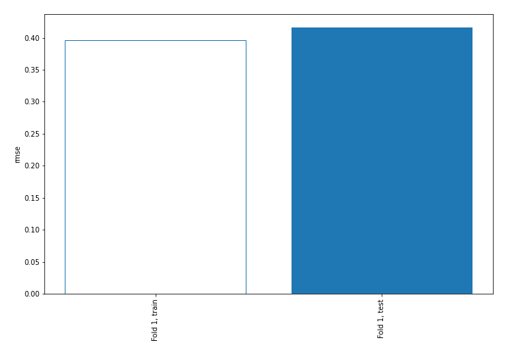
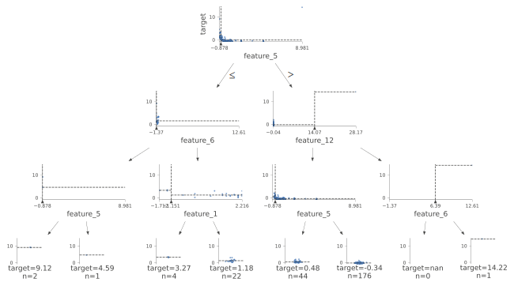
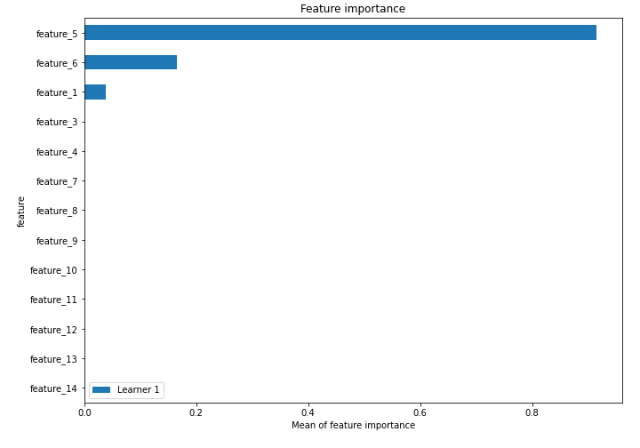
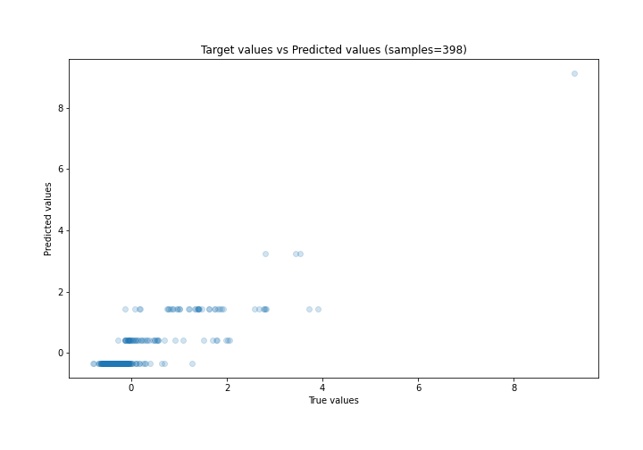
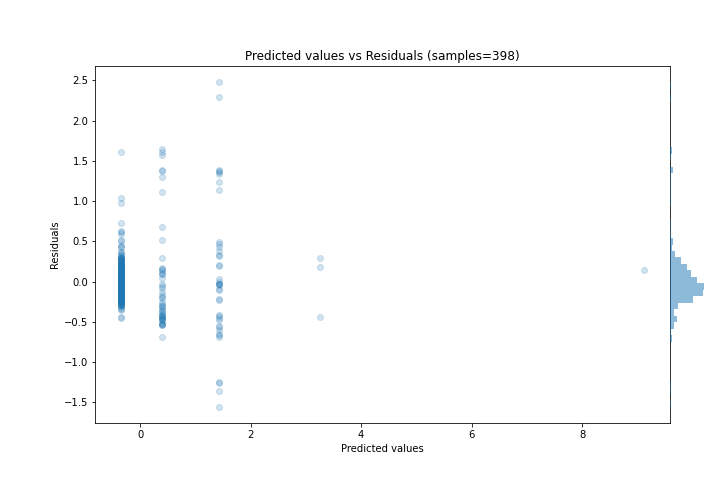
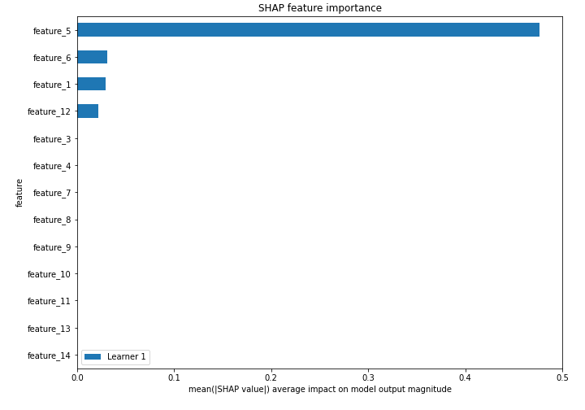
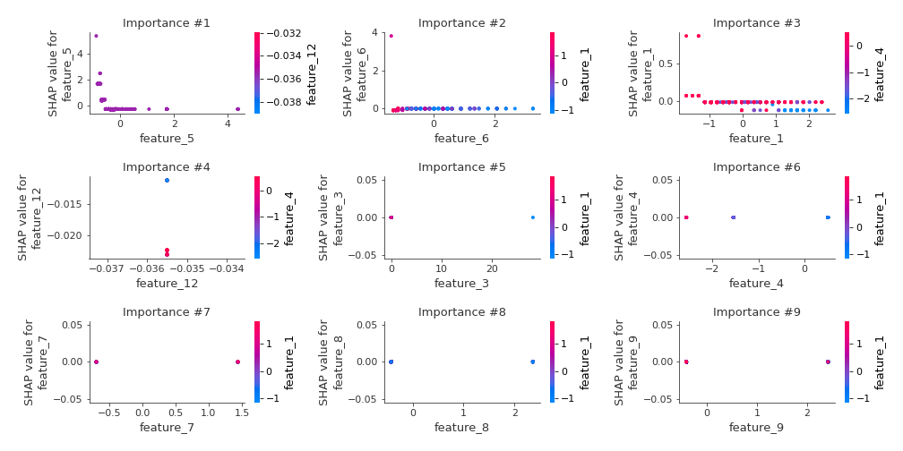
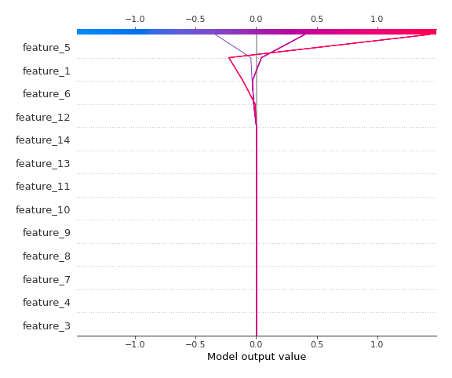
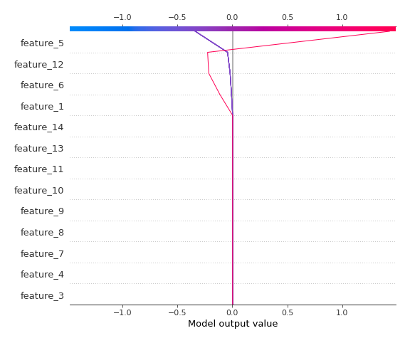

# Summary of 2_DecisionTree

[<< Go back](../README.md)

## Decision Tree
- **n_jobs**: -1
- **criterion**: mse
- **max_depth**: 3
- **explain_level**: 2

## Validation
 - **validation_type**: split
 - **train_ratio**: 0.75
 - **shuffle**: True

## Optimized metric
rmse

## Training time

6.8 seconds

### Metric details:
| Metric   |     Score |
|:---------|----------:|
| MAE      |  0.249343 |
| MSE      |  0.173088 |
| RMSE     |  0.416039 |
| R2       |  0.786598 |
| MAPE     | 16.1133   |

## Learning curves

## Decision Tree 

### Tree #1

### Rules

if (feature_5 > -0.693) and (feature_12 <= 14.067) and (feature_5 > -0.554) then response: -0.337 | based on 910 samples

if (feature_5 > -0.693) and (feature_12 <= 14.067) and (feature_5 <= -0.554) then response: 0.402 | based on 164 samples

if (feature_5 <= -0.693) and (feature_6 > -1.335) and (feature_1 > -1.151) then response: 1.43 | based on 96 samples

if (feature_5 <= -0.693) and (feature_6 > -1.335) and (feature_1 <= -1.151) then response: 3.248 | based on 13 samples

if (feature_5 <= -0.693) and (feature_6 <= -1.335) and (feature_5 > -0.868) then response: 4.862 | based on 4 samples

if (feature_5 <= -0.693) and (feature_6 <= -1.335) and (feature_5 <= -0.868) then response: 9.118 | based on 2 samples

if (feature_5 > -0.693) and (feature_12 > 14.067) and (feature_6 > 6.389) then response: 14.222 | based on 1 samples

if (feature_5 > -0.693) and (feature_12 > 14.067) and (feature_6 <= 6.389) then response: 12.368 | based on 1 samples

## Permutation-based Importance

## True vs Predicted

## Predicted vs Residuals

## SHAP Importance

## SHAP Dependence plots

### Dependence (Fold 1)

## SHAP Decision plots

### Top-10 Worst decisions (Fold 1)

### Top-10 Best decisions (Fold 1)

[<< Go back](../README.md)
