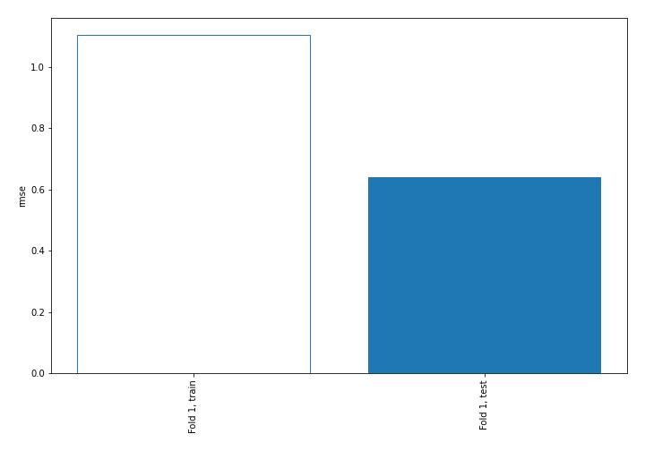
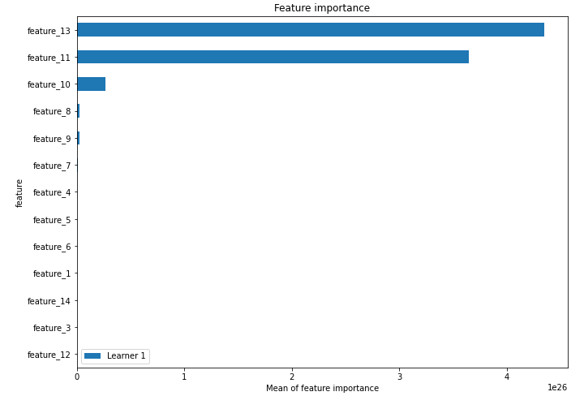
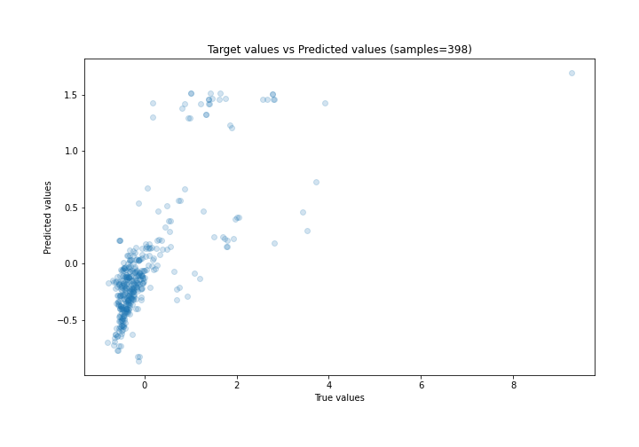
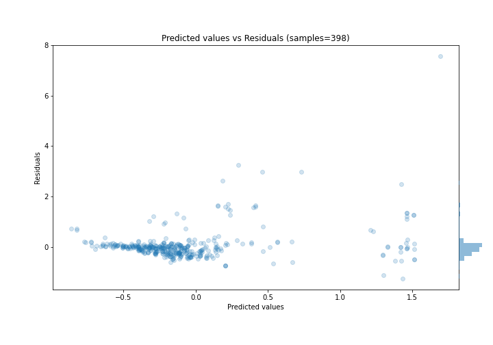
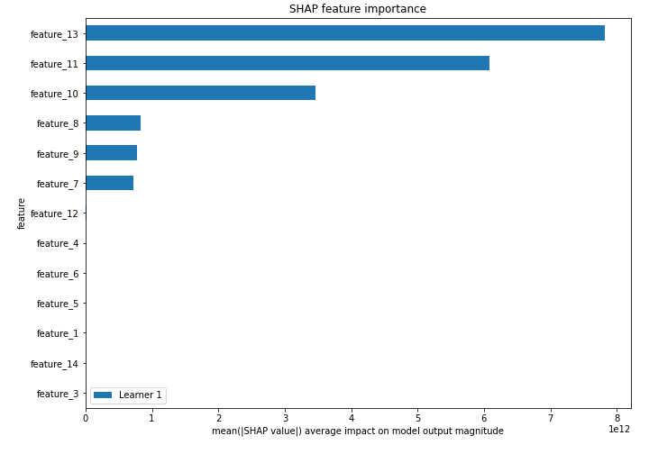
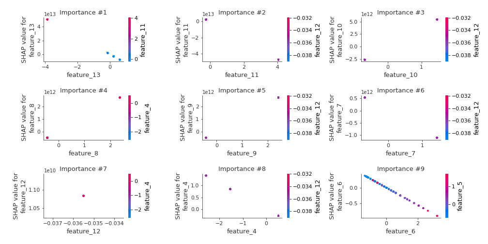
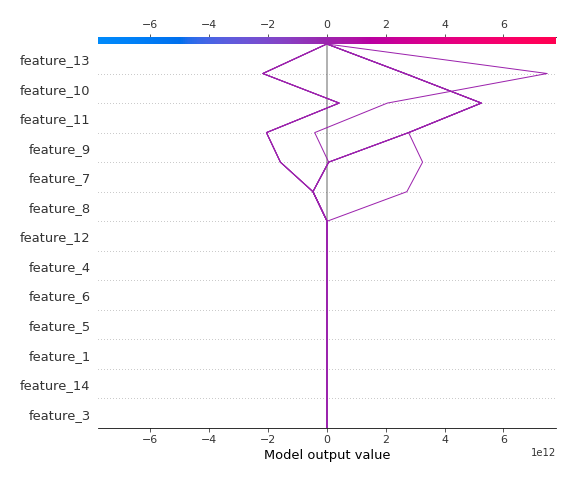
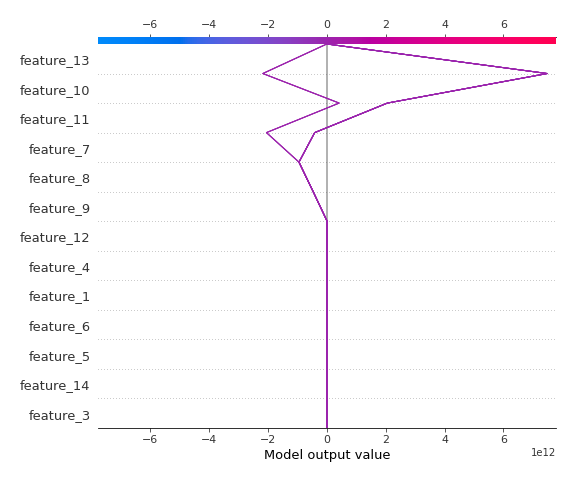

# Summary of 3_Linear

[<< Go back](../README.md)

## Linear Regression (Linear)
- **n_jobs**: -1
- **explain_level**: 2

## Validation
 - **validation_type**: split
 - **train_ratio**: 0.75
 - **shuffle**: True

## Optimized metric
rmse

## Training time

5.2 seconds

### Metric details:
| Metric   |    Score |
|:---------|---------:|
| MAE      | 0.295632 |
| MSE      | 0.411717 |
| RMSE     | 0.641652 |
| R2       | 0.49239  |
| MAPE     | 3.41713  |

## Learning curves

## Coefficients
| feature    |    Learner_1 |
|:-----------|-------------:|
| feature_10 |  3.74018e+12 |
| feature_8  |  1.14499e+12 |
| feature_9  |  1.12514e+12 |
| intercept  |  0.00508265  |
| feature_3  | -0.00220209  |
| feature_14 | -0.0198348   |
| feature_1  | -0.217303    |
| feature_6  | -0.282325    |
| feature_5  | -0.331633    |
| feature_4  | -0.548058    |
| feature_12 | -2.28825e+11 |
| feature_7  | -7.68345e+11 |
| feature_11 | -1.15918e+13 |
| feature_13 | -1.29235e+13 |

## Permutation-based Importance

## True vs Predicted

## Predicted vs Residuals

## SHAP Importance

## SHAP Dependence plots

### Dependence (Fold 1)

## SHAP Decision plots

### Top-10 Worst decisions (Fold 1)

### Top-10 Best decisions (Fold 1)

[<< Go back](../README.md)
